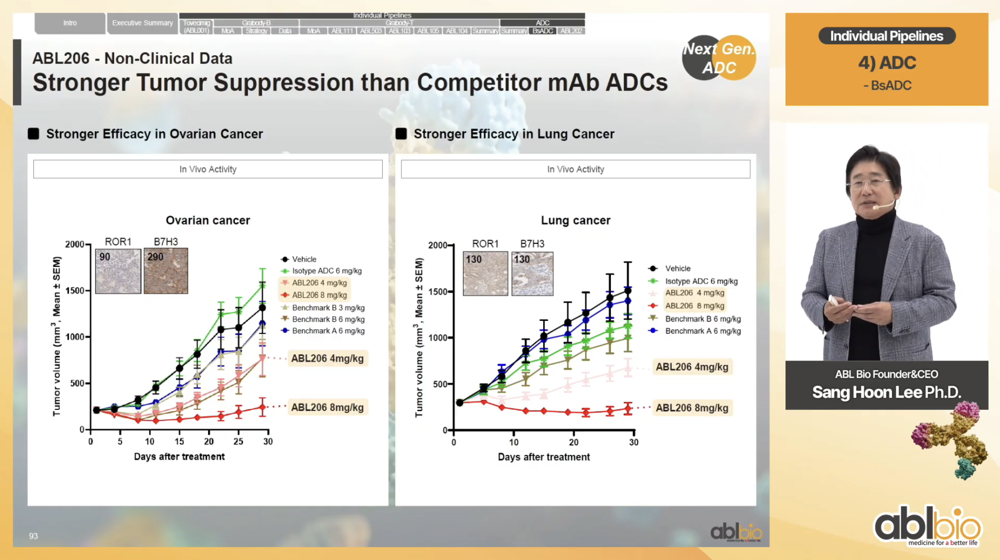

# NEOK001: Asset Profile: ROR1×B7-H3 Bispecific ADC
*Author: Yuying Fan | April 2026*  

## 1. Company Background
*Sources: [[1](https://www.ablbio.com/en/company/intro)], [[2](https://www.businesswire.com/news/home/20251104428562/en/NEOK-Bio-Launches-from-Stealth-with-%2475-Million-Series-A-to-Advance-Next-Generation-Bispecific-Antibody-Drug-Conjugates-ADC-in-Oncology)], [[3](https://www.businesswire.com/news/home/20260121856133/en/NEOK-Bio-Receives-FDA-IND-Approval-for-NEOK001-A-First-In-Class-B7-H3ROR1-Bispecific-ADC-for-Treatment-of-Solid-Tumor-Cancers)], [[4](https://www.biopharmadive.com/news/neok-bio-bispecific-adc-biotech-startup-launch-abl/804378/)], [[5](https://www.neokbio.com/science)], [[6](https://www.prnewswire.com/news-releases/abl-bio-taps-into-synaffix-adc-technology-to-accelerate-development-of-bispecific-adc-products-301924608.html)]*

### <u>ABL Bio</u>
ABL Bio, Inc. is a South Korean biotechnology company that focuses on bispecific antibodies for immuno-oncology and neurodegenerative diseases. The core technology is their Grabody bispecific platforms. 
- For immuno-oncology, they have developed Grabody-T that focuses specifically on engaging with 4-1BB–mediated immune signaling for cancer immunotherapy
- Also for immuno-oncology, Grabody-I was developed to block immune checkpoints on T cells, both PD-L1 and LAG-3, to increase T cell activation
- For neurodegenerative diseases, Grabody-B has been designed to enhance blood–brain barrier (BBB) penetration for therapies with CNS targets

### <u>NEOK Bio</u>
ABL Bio launched its US-based spinout, NEOK Bio, Inc., in November 2025. NEOK Bio is an US biotechnology company focused on antibody drug conjugates (ADCs) development in cancer treatment, a separate modality from ABL Bio's Grabody platforms.  

The company's prinicipal investor is ABL Bio, with NEOK Bio emerging from stealth mode with $75 million in Series A funding from ABL Bio. This fund will be used to advance two bispecific ADC oncology programs into clinical trials. The two lead assets are <span style="color: blue;">NEOK001 (ABL206)</span> and NEOK002 (ABL209). Both candidates are aimed at treating a range of solid tumors.
- NEOK001 is a ROR1 and B7-H3 bispecific ADC
- NEOK002 is an EGFR and MUC1 bispecific ADC

NEOK has not specified which tumors it'll go after but Mayank Gandhi, Neok’s CEO, mentioned this dual-targeting strategy should be able to target a wide range of indications with large unmet needs. The initial focus will be on **thoracic, gastrointesticanl and gynecological cancers**, which are known to be sensitive to Topo-I inhibition.
- In January 16, 2026, the FDA had approved NEOK001's IND application
- NEOK Bio plans to initiate Phase 1 clinical study by 1H2026 and share the initial clinical results in 2027
- Currently, as of April 2026, NEOK001 is NEOK Bio's first program to enter clinical development

In summary, NEOK Bio will run clinical development and commercialization for the two ADCs, while ABL Bio is the originator and hold the foundational patents

### <u>Considerations in Licensing</u>
NEOK001 uses the <span style="color: blue;">SYNtecan E™</span> linker-payload platform licensed by ABL BIO from Synaffix (acquired by Lonza in May 2023). 
- ABL Bio and Synaffix had entered a licensing agreement to develop BsADCs 
- In this agreement, Synaffix receives an upfront payment, milestone payments, and tiered royalties
- Meanwhile, Synaffix would be responsible in manufacturing components related to its proprietary SYNtecan E™ platform comprising of GlycoConnect™, HydraSpace™ and toxSYN™

**This proprietary SYNtecan E™ platform consists of 3 components:**  
- <span style="color: blue;">GlycoConnect™</span> is a conjugation technology that enables for site-specific payload attachment by targeting the native antibody glycan and also can control DAR
- <span style="color: blue;">HydraSpace™</span> is a compact, polar spacer that improves the therapeutic index of ADCs, particularly when using hydrophobic payloads
- <span style="color: blue;">toxSYN™</span> is a linker-payload platform that includes multiple validated mechanisms of action; including Topo-I inhibitor SYNtecan E™, DNA damaging agents (SYNeamicin D™ and SYNeamicin G™), ⍺-Microtubule (SYNtansine™) and β-Microtubule (SYNstatin E™ and SYNstatin F™) inhibitors, and other Synaffix proprietary linker-payloads

<br>
<hr style="border: 2px solid black;">

## 2. NEOK001 Asset Overview

### <u>Introduction</u>

NEOK001 (or ABL206) is a **first-in-class BsADC** designed to simultaneously bind two tumor-associated surface proteins (ROR1xB7-H3) and deliver a potent Topo-I payload to the cancer cells.

The Topo-I payload and cleavable SYNtecan-E linker are well-matched to **heterogeneously-expressing** solid tumors where bystander killing can compensate for incomplete antigen coverage — a property particularly relevant for ROR1, which shows patchy expression in some tumor types.

### <u>Timeline</u>

| Date | Milestone |
|------|-----------|
| 2019 | ROR1 and B7-H3 antibody arm patents filed (ABL Bio) |
| 2020 | CS5001† (ROR1 monospecific ADC) licensed to CStone |
| 2021 | Bispecific ADC-related WO patent applications filed |
| 2023 | Bispecific format patent filed |
| Nov 2025 | NEOK Bio spun out with $75M Series A |
| Dec 2025 | IND application for NEOK001 submitted to FDA |
| Jan 2026 | FDA IND clearance received |
| Mid-2026 | Phase 1 trial initiation planned |
| 2027 | Clinical data readout expected |

_†CS5001 is a ROR1 ADC co-developed by ABL Bio & LigaChem Biosciences. As of April 2026, it is currently in Phase 1b trial_

<br>
<hr style="border: 2px solid black;">

## 3. Mechanism of Action
*Sources: [[1](https://www.sciencedirect.com/science/article/pii/S0165614725001841)], [[2](https://pubmed.ncbi.nlm.nih.gov/33051306/)], [[3](https://www.merck.com/news/ifinatamab-deruxtecan-demonstrated-clinically-meaningful-response-rates-in-patients-with-extensive-stage-small-cell-lung-cancer-in-ideate-lung01-phase-2-trial/)], [[4](https://www.thelancet.com/journals/lanonc/article/PIIS1470-2045(25)00733-8/fulltext)], [[5](https://www.nature.com/articles/s41420-024-02239-1)], [[6](https://www.merck.com/news/mercks-investigational-zilovertamab-vedotin-at-1-75-mg-kg-dose-plus-standard-of-care-showed-promising-antitumor-activity-including-complete-response-rate-in-patients-with-relapsed-refractor/)], [[7](https://pubmed.ncbi.nlm.nih.gov/40762544/)], [[8](https://ascopubs.org/doi/10.1200/JCO.2024.42.16_suppl.3023)]*

### <u>Target Biology: B7-H3 _(CD276)_</u>
- Member of B7 family of immune checkpoint proteins
- Immune checkpoint protein and tumor-associated antigen
- Broadly overexpressed across many different human cancer types (high frequency, 60% of 25,000 tumor samples)

In non-malignant tissues, main role is to inhibit adaptive immunity to prevent overactive immune response; suppressing T-cell activation and proliferation
- Although the receptor(s) for B7-H3 are unknown 
- Limited expression in normal tissues

In tumor cells, this is overexpressed for immune suppression (as well as for its non-immune protumorigenic properties; e.g. migration, chemoresistance)
- Its expression in tumors is associated with poor prognosis 
- Promotes immune evasion AND non-immune tumor progression mechanisms

_There are currently, in 2026, no B7-H3 directed therapies approved for cancer treatment_

**Clinical context as an ADC target:**  
Ifinatamab deruxtecan (DS-7300, Daiichi Sankyo/Merck) showed clinical meaningful response rates in previously treated extensive-stage SCLC pateints during their Phase 2 trial IDeate-Lung01
- Is a B7-H3 ADC that uses Topo-I inhibitor payload (an exatecan derivative, DXd)
- ORR of 48.2% in these patients
In IDeate-PanTumor02, the previous Phase 1b/2 pan-tumor trial, an ORR of 34% was seen
- Promising anti-tumour activity was seen in a wange of solid tumors
- Patients were those with advanced treatment-refractory solid tumors, which included SCLC, NSCLC, HNSCC, prostate cancer, endometrial cancer and other solid tumors

### <u>Target Biology: ROR1 _(Receptor Tyrosine Kinase-like Orphan Receptor 1)_</u>
Oncofetal protein
- Embryonic receptor highly expressed during embryonic development; being involved in cell differnatiation
- Is normally absent or very low after in adult tissues

Re-expressed in many solid tumors and hematological malignancies
- Promotes tumor cell survival, proliferation, and metastasis

_There are also currently, in 2026, no ROR1 directed therapies approved for cancer treatment_

**Clinical context as an ADC target:**  
Compared to B7-H3, ROR1 remains a less clinically mature ADC target (more heterogeneous expression and less clinical results to date) but does show promise

Zilovertamab vedotin (MK-2140, Merck) is a ROR1 targeting ADC with a microtubulin-targeting agent
- Showed promising efficacy in patients with relapsed or refractory DLBCL
- 56.3% ORR in combination with standard of care in Phase 2/3 WaveLINE-003 trial
Next, they examined activity in previously treated metastatic solid tumors in Phase 2 trial (NCT04504916)
- Included participants with TNBC, NSCLC, ovarian cancer, pancreatic cancer
- However, the result was minimal activity (though manageable safety)

CS5001 (created by LigaChem Biosciences + <span style="color: blue;">ABL Bio</span>, then licensed to CStone in 2020) is also a ROR1-targeting ADC being tested in solid tumors and lymphomas
- Promising results from Phase1a/b in patients with advanced solid tumors and lymphomas
- Antitumor activity in multiple advanced solid tumors and lymphomas

### <u>Bispecific Structure of NEOK001</u>
```
[Anti-ROR1 Arm] ─────┐
                     ├── Bispecific Antibody ── Linker ── Topo-I Payload
[Anti-B7-H3 Arm] ────┘
```

**Advantages of a BsADC over monospecific:**  
Based on AACR 2026 Poster Abstract, the benefit of NEOK001 is in <span style="color: red;">"combining the broad expression of B7-H3 with the selective expression of ROR1 to enhance tumor-specific binding while reducing toxicity to normal tissue"</span>

| Feature | Monospecific ADC | NEOK001 (BsADC) |
|---------|-----------------|--------------------------|
| Targeting | Single antigen | Dual antigen (ROR1 + B7-H3) |
| Selectivity | Depends on antigen specificity | Potentially higher, enhanced binding to cells with co-expression|
| On-target/off-tumor toxicity | Depends on antigen specificity | Potentially lower - co-expression rare in normal tissue |
| Internalization rate | Target-dependent | Potentially increased; dual binding/avidity enhances uptake |
| Resistance | Single mechanism | Requires dual resistance, harder to escape |
| Tumor coverage | Limited by single antigen positives | Potentially broader, can engage either antigen with enahced binding to co-expressed |

### <u>Linker & Payload</u>

NEOK001 uses **SYNtecan-E™**:
- **Payload:** Exatecan, potent topoisomerase I (Topo-I) inhibitor
- **Linker:** Dipeptide cleavable linker
- **Conjugation:** GlycoConnect™, site-specific attachment to antibody glycan 
  for homogeneous, stable ADC with a precise drug-to-antibody ratio (DAR)
- **HydraSpace™:** Polar spacer technology that improves solubility and therapeutic index vs hydrophobic payloads

<br>
<hr style="border: 2px solid black;">

## 4. NEOK001 Preclinical Efficacy Data
*Sources: [[1](https://www.youtube.com/watch?v=GpLdrk-Vdzg&list=PLuQQ6w1jBXamvNuFR1t88Dze2QUv8uw22&index=17)],[[2](https://www.neokbio.com/news-2026-jan21)]*


_2025 ABL Bio Presentation Slide_

### Ovarian Cancer Model
- NEOK001 at 8 mg/kg: Near-complete tumor regression vs vehicle
- NEOK001 at 4 mg/kg: Significant tumor suppression
- Outperformed benchmark monospecific ADCs (Benchmark A and B) at same dose
- ROR1 H-score: 90 & B7-H3 H-score: 290 (high dual expression)

### Lung Cancer Model
- Similar efficacy pattern to ovarian cancer model
- ROR1 H-score: 130 & B7-H3 H-score: 130 (high dual expression)

### KPreclinical Findings
_From NEOK Bio's poster abstract for AACR 2026; "Poster 1724: NEOK001: A first-in-class B7-H3xROR1 bispecific ADC demonstrated enhanced efficacy and promising tolerability")_
- Strong cancer cell killing through dual-targeting with strong bystander killing (for heterogenous solid tumors)
- Showed broad efficacy across 38 PDX models, with 84% tumor growth inhibition & 53% deep tumor regression in 9 major cancer types
- Favorable safety profile in GLP toxicology studies (HNSTD: 60 mg/kg), alongside consistent DAR and predictable pharmacokinetics

<br>
<hr style="border: 2px solid black;">

