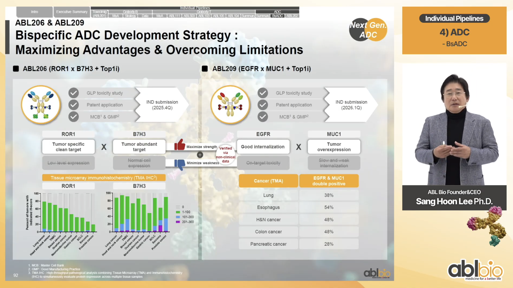
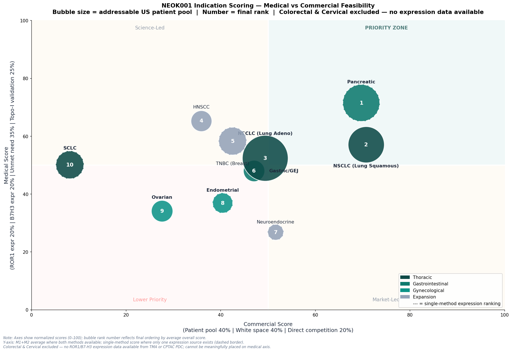

# Indication Scoring — Medical & Commercial Feasibility Analysis
*Author: Yuying Fan | April 2026*  
*Full methodology, code and data: [`notebooks/3_indication_scoring.ipynb`](../notebooks/3_indication_scoring.ipynb)*  
Phase 1 Indication Selection | US Market

## 1. Objective
Identify the optimal initial indications for NEOK001 Phase 1 clinical development using a framework of (1) Biological: Is the biology there? 
and (2) Market Opportunity: Is a financial incentive there? 

Each candidate indication will be scored on two axes:
1. Medical fit — ROR1 & B7-H3 expression and unmet need
2. Commercial opportunity — US incidence, addressable patient fraction, and competitive density 

These values are then plotted on a 2×2 prioritization matrix and an overall score will be given based on equal weighing:  
`Overall Score = Medical Score × 0.5 + Commercial Score × 0.5`

 

## 2. Indication Candidates
This analysis will evaluate **12 indications** across Neok Bio CEO's stated intial focus on **thoracic, gastrointestinal and gynecological cancers** [[Source](https://www.biopharmadive.com/news/neok-bio-bispecific-adc-biotech-startup-launch-abl/804378/)], as well as expansion candidates that were mentioned in NEOK001's TMA IHC data [during a 2025 presentation by ABL Bio's CEO, ([Source](https://youtu.be/GpLdrk-Vdzg?list=PLuQQ6w1jBXamvNuFR1t88Dze2QUv8uw22&t=62)])

<u>Thus these were the 12 candidate indications found by looking at these criteria:</u>
| Indication | Priority Category | TMA IHC Data |
|-----------|-------------|--------------|
| NSCLC (Lung Adeno) | Thoracic ✅ | ✅ _(labeled "Lung Cancer")_ |
| NSCLC (Lung Squamous) | Thoracic ✅ | ✅ _(labeled "Lung Cancer")_ |
| SCLC | Thoracic ✅ | ✅ |
| Gastric/GEJ | Gastrointestinal ✅ | ✅ |
| Colorectal | Gastrointestinal ✅ | ❌ |
| Pancreatic | Gastrointestinal ✅ | ❌ |
| Ovarian | Gynecological ✅ | ✅ |
| Cervical | Gynecological ✅ | ❌ |
| Endometrial | Gynecological ✅ | ❌ |
| HNSCC | Expansion ❌ | ✅ |
| TNBC | Expansion ❌ | ✅ |
| Neuroendocrine | Expansion ❌ | ✅ |

 

## 3. Components for Calculating Score

### 3.1 Expression Data - Two Independent Methods
For each indication, metrics for ROR1 and B7-H3 protein expression were obtained using two methods and independent data sources to assess relative ranking robustness:

| Method | Source | What it measures | Coverage |
|--------|--------|-----------------|---------|
| #1 TMA IHC Primary | TMA IHC slide from 2025 | % tumors by IHC H-score | 8/12 indications |
| #2 CPTAC Primary | PDC API (pdc.cancer.gov) | Protein log2 abundance ratio | 8/12 indications |
---
_CPTAC = Clinical Proteomic Tumor Analysis Consortium_

### <u>Method 1 (M1) — TMA IHC Primary</u>
*Source: [ABL Bio CEO slide, 2025 (tissue microarray IHC data](https://youtu.be/GpLdrk-Vdzg?list=PLuQQ6w1jBXamvNuFR1t88Dze2QUv8uw22&t=62))*

**Tissue Microarray Immunohistochemistry (TMA IHC)** is the gold standard method for assessing protein expression for ADC target selection

- **Tissue Microarray (TMA):** Hundreds of tumor cores from different patients arrayed on a single glass slide (enables consistent staining conditions across all tumor types simultaneously)
- **Immunohistochemistry (IHC):** Antibody staining that detects a specific protein in tissue sections; visualized under microscope as colored signal
- **H-score (0-300):** Standardized quantification: `H-score = staining intensity (0-3) × % positive cells`

_TMA IHC Data seen on bottom left_

ABL Bio CEO Sang Hoon Lee presented these TMA IHC bar charts for ROR1 and B7-H3 protein expression across 10 cancer types in their 2025 investor [presentation](https://youtu.be/GpLdrk-Vdzg?list=PLuQQ6w1jBXamvNuFR1t88Dze2QUv8uw22&t=62).

The bar charts show **% of tumors in each H-score category:**

| H-score | Color | Interpretation | ADC targetability |
|---------|-------|---------------|-------------------|
| 0 | White/Blank | Negative — no protein detected | Not targetable |
| 1–100 | Green | Low expression | Borderline |
| 101–200 | Blue | Moderate expression | Potentially targetable |
| 201–300 | Purple | High expression | Strongly targetable |

 

> This slide is relevant because:
> - Measures **actual surface protein** — what ADC binds
> - Likely uses **the same antibody** developed for the NEOK001 program specifically
> - **H-score distribution** shows what fraction of patients would be eligible
> - Is generated by ABL Bio - the originator of the bispecific construct

 

I defined two metrics from the distribution:
- Any detectable expression: `% any positive = H(1-100) + H(101-200) + H(201-300)`
- A clinically relevant threshold: `% targetable = H(101-200) + H(201-300)`

The H-score distributions were used to compute a **weighted expression score**:  
`tma_weighted = (pct_any_positive × 0.4) + (pct_targetable × 0.6)`
   - `pct_any_positive` — % of tumor cores with any detectable staining
   - `pct_targetable` — % of tumor cores with H-score > 100
   - Weighting rationale: H-score > 100 is more clinically relevant for ADC binding, so weighed more; but any detectable expression still does contributes to binding

| Indication | ROR1 any+ | ROR1 H>100 | ROR1 expression score | B7H3 any+ | B7H3 H>100 | B7H3 expression score |
|-----------|----------|-----------|---------|----------|-----------|---------|
| NSCLC (Lung Adeno)† | 79% | 8% | 36.4 | 88% | 10% | 41.2 |
| NSCLC (Lung Squamous)† | 79% | 8% | 36.4 | 88% | 10% | 41.2 |
| HNSCC | 75% | 5% | 33.0 | 94% | 20% | 49.6 |
| TNBC (Breast) | 70% | 1% | 28.6 | 91% | 33% | 56.2 |
| Ovarian | 60% | 0% | 24.0 | 85% | 4% | 36.4 |
| Neuroendocrine | 46% | 2% | 19.6 | 70% | 7% | 32.2 |
| Gastric/GEJ | 38% | 0% | 15.2 | 49% | 2% | 20.8 |
| SCLC | 36% | 0% | 14.4 | 87% | 15% | 43.8 |
| Colorectal | N/A | N/A | N/A | N/A | N/A | N/A |
| Pancreatic | N/A | N/A | N/A | N/A | N/A | N/A |
| Cervical | N/A | N/A | N/A | N/A | N/A | N/A |
| Endometrial | N/A | N/A | N/A | N/A | N/A | N/A |

_† based on "Lung cancer" labeled bar in the TMA IHC slide_
*Note: Values were determined from the bar chart in the presentation and measured using [plotdigitizer](https://plotdigitizer.com/app); They are not specific published raw numbers from ABL Bio*

> **Observations**  
> - ROR1 H-score >100 is near zero across all tumors (max 8% in NSCLC) → ROR1 is present but at low surface density; a bispecific format would compensate   
> - B7-H3 is more variable → TNBC has the highest targetable B7-H3 (33% H>100), followed by HNSCC (20%) and SCLC (15%)  
> - Gastric/GEJ is the only indication with an H-score 201–300 for B7-H3 → highest intensity signal

---

### <u>Method 2 (M2) — CPTAC Primary</u>
*Source: PDC API (Clinical Proteomic Tumor Analysis Consortium, mass spectrometry protein abundance)*

The **Clinical Proteomic Tumor Analysis Consortium (CPTAC)** is an NCI-funded
program that generates deep proteogenomic profiles of human tumors using
**Tandem Mass Tag (TMT) mass spectrometry**. 

Unlike RNA sequencing which measures transcript abundance, CPTAC directly quantifies **protein abundance**, making it a relevant and good publicly available expression dataset for ADC target selection, since ADCs bind surface proteins not transcripts

#### <u>Key properties of CPTAC protein data:</u>
- **Metric:** median log2 ratio relative to a common reference pool per study
  - log2 > 0: protein MORE abundant than study average
  - log2 < 0: protein LESS abundant than study average
  - log2 = 0: protein at average abundance
- **Sample type:** Bulk tumor tissue (not single cell)
- **Reference:** Common pooled reference; consistent within each study

Accessed via PDC GraphQL API (pdc.cancer.gov); no authentication required

| Indication | ROR1 log2 | ROR1 n | ROR1 det% | B7H3 log2 | B7H3 n | B7H3 det% | Study |
|-----------|----------|--------|----------|----------|--------|----------|-------|
| NSCLC (Lung Adeno) | +0.002 | 270 | 100% | -0.006 | 270 | 100% | LUAD Confirmatory |
| NSCLC (Lung Squamous) | +0.200 | 190 | 86% | -0.136 | 220 | 100% | LSCC Discovery |
| Gastric/GEJ | +0.153 | 187 | 85% | -0.207 | 221 | 100% | CPTAC STAD |
| Pancreatic | +0.080 | 212 | 92% | -0.124 | 230 | 100% | CPTAC PDA |
| Ovarian | -0.007 | 190 | 91% | +0.005 | 210 | 100% | PTRC HGSOC FFPE |
| Endometrial | -0.167 | 158 | 100% | +0.181 | 158 | 100% | UCEC Confirmatory |
| HNSCC | -0.035 | 59 | 30% | -0.243 | 199 | 100% | HNSCC Discovery |
| TNBC (Breast) | Not detected‡ | — | — | -0.026 | 30 | 100% | PTRC TNBC |
| SCLC | Not detected‡ | — | — | -0.048‡ | 112 | N/A§ | Liu et al. 2024 (external) |
| Colorectal | N/A | — | — | N/A | — | — | Null matrix |
| Cervical | N/A | — | — | N/A | — | — | Null matrix |
| Neuroendocrine | N/A | — | — | N/A | — | — | Null matrix |

**‡** _ROR1 genuinely absent from ALL TNBC proteomics studies in PDC (8,844 proteins quantified) and from SCLC proteome study by Liu et al. Cell 2024. It could be below detection limit, biologically meaningful absence_
**§** _Liu et al. Table S3A reports summary statistics only, per-sample detection rate not available_

> **Note on expression metric:**  
> CPTAC log2 values reflect protein abundance relative to a study-specific pooled reference sample; a mix of multiple tumor types used as a normalization anchor across all samples in that study.
> A positive value indicates higher abundance than the reference pool average; a negative value indicates lower.  
> This metric would help support **cross-indication comparison** (which tumor type expresses more ROR1 &/or B7H3 relative to other cancer types) and is appropriate for ADC indication prioritization where the goal is identifying which cancer type presents the highest target density.  
> This is different from **tumor vs. normal adjacent tissue (T/NAT) log2 fold change**, which measures whether a protein is enriched in tumor relative to the patient's own healthy tissue. 
> T/NAT would be a more relevant metric for assessing on-target off-tumor toxicity risk and companion diagnostic development but not for doing a cross-indication ranking against a common baseline.
>
> The Liu et al. (Cell 2024) SCLC value for CD276 (log2FC = -0.049 vs NAT, p = 0.490) is a T/NAT metric and is **not directly comparable** to the other CPTAC log2 ratios in this table. It is included for biological context, specifically it confirmed that B7H3 is not tumor-enriched in SCLC relative to normal lung tissue in this study, which is relevant to the safety and targeting rationale.

#### <u>Data Availability Limitations</u>

**Colorectal**  
Three PDC studies were queried (TCGA Colon Cancer Proteome, Prospective
Colon PNNL, Prospective Colon VU) but all returned null quantitative matrices
for log2_ratio and related data types. Examining them further, the TCGA Colon proteomics study uses
quantile-normalized log2-transformed spectral counts rather than TMT-based
log2 ratio quantification, making values non-comparable to the
CPTAC mass spectrometry data used for other indications. Thus, the indication was excluded from
the expression-based ranking (⚠ NR) as no values for both expression methods.

**Cervical**  
KU CCA Discovery Study was queried and returned a null quantitative matrix.
Data may exist in PDC under an incompatible data type but was not
retrievable via the quantDataMatrix API. Excluded from expression-based
ranking (⚠ NR).

**Neuroendocrine (G3 NEC)**  
NF-PNET PhaseI, PhaseII, and Validation studies all returned null matrices.
Examined the associated literature, NF-PanNET proteogenomics dataset (Cancer Cell, 2025), which was recently published 
and may have not been converted into a quantDataMatrix format yet. However, this study covers
well-differentiated G1/G2 tumors, a molecularly distinct disease from the
G3 poorly differentiated NEC subtype that would be targeted by NEOK001's Topo-I payload.
Could not find a dedicated proteomics dataset for G3 NEC in the literature so it was excluded from expression-based ranking (⚠ NR).

**SCLC**  
No CPTAC study in PDC. External validation was done via Liu et al. (Cell, 2024; n=112 Chinese SCLC, TMT-MS) that confirms, based on Table S3A, that ROR1 is absent from SCLC proteome. CD276 (B7-H3) was detected but not tumor-enriched (log2FC = -0.048, p = 0.490 vs NAT), consistent with low TMA-based expression scores and a low indication ranking. Thus, the indication was ranked using only M1

 

> **Observations**  
> - NSCLC Squamous has the highest ROR1 of all CPTAC indications (+0.200)
> - Gastric/GEJ has meaningful ROR1 (+0.153, 85% detected)
> - Endometrial has the most negative ROR1 (-0.167) — below study average
> - HNSCC ROR1 detection is only 30% in a small cohort (n=59) — low reliability
> - All B7H3 CPTAC values are near-neutral — consistent with ABL Bio's TMA IHC showing predominantly low H-score staining

---

### <u> Expression Data - Combining Results of Method 1 & Method 2</u>

**Moderate Confidence Flag:**
- Both methods agree (rank delta ≤ 1) → **High confidence**
- Methods diverge (rank delta > 1) → **Moderate confidence**, flagged in output table
- Method 2 not applicable → **M1 ONLY** (single method ranking was applied to TNBC, SCLC & Neuroendocrine)
- Method 1 not applicable → **M2 ONLY** (single method ranking was applied to Pancreatic & Endometrial)
- No expression data from either M1 nor M2 for Colorectal & Cervical. So these two indications were removed from further ranking

| Indication | TMA | CPTAC | External | M1 Source | M2 Source | Ranked |
|---|---|---|---|---|---|---|
| NSCLC (Lung Adeno) | ✅ | ✅ | — | TMA weighted | CPTAC log2 | ✅ |
| NSCLC (Lung Squamous) | ✅ | ✅ | — | TMA weighted | CPTAC log2 | ✅ |
| Gastric/GEJ | ✅ | ✅ | — | TMA weighted | CPTAC log2 | ✅ |
| Pancreatic | ❌ | ✅ | — | ⚠ N/A - M2 only | CPTAC log2 | ✅ |
| Ovarian | ✅ | ✅ | — | TMA weighted | CPTAC log2 | ✅ |
| Endometrial | ❌ | ✅ | — | ⚠ N/A - M2 only | CPTAC log2 | ✅ |
| HNSCC | ✅ | ✅ | — | TMA weighted | CPTAC log2 | ✅ |
| TNBC (Breast) | ✅ | B7H3 only (n=30)* | — | TMA weighted | ⚠ N/A - M1 only | ✅ |
| SCLC | ✅ | ❌ | Liu et al. 2024† | TMA weighted | ⚠ N/A - M1 only | ✅ |
| Neuroendocrine (G3) | ✅ | ❌ | ❌‡ | TMA weighted | ⚠ N/A - M1 only | ✅ |
| Colorectal | ❌ | ❌ | — | — | — | ⚠ NR |
| Cervical   | ❌ | ❌ | — | — | — | ⚠ NR |

**\*** *TNBC: ROR1 absent from all TNBC proteomics in PDC (8,844 proteins
quantified — biologically meaningful absence). B7H3 CPTAC n=30 only;
insufficient sample size. M2 not applicable - M1 (TMA) only.*

**†** *SCLC: No CPTAC study in PDC. External validation via Liu et al.
(Cell 2024, n=112, TMT-MS): ROR1 absent from SCLC proteome; CD276
log2FC = -0.048 vs NAT (p = 0.490), not tumor-enriched. TMA→log2
fallback not used — not comparable to CPTAC log2 ratio scale.
M1 (TMA) only.*

**‡** *Neuroendocrine (G3): No CPTAC study in PDC. NF-PanNET proteogenomics
(Cancer Cell 2025) covers G1/G2 only — molecularly distinct from G3 NEC.
No G3 NEC proteomics dataset available. TMA→log2 fallback not used —
not comparable to CPTAC log2 ratio scale. M1 (TMA) only.*

**⚠ NR** *= Not Ranked — no expression data from TMA or CPTAC PDC.
Colorectal: PDC studies return null quantitative matrices (spectral count
format, incompatible with TMT log2 ratio). Cervical: KU CCA Discovery
Study returns null matrix. Absence of data ≠ absence of expression,
both should be revisited if compatible proteomics data becomes available.*

 

### 3.2 US Epidemiology

All values reflect the **2L+ metastatic setting**, the most likely treatment context
NEOK001 would enter as an ADC, with the long-term goal of label expansion
into earlier lines. ADCs typically launch in 2L+ but will try to expand to 1L as Phase 3 data matures. 

For unmet need scoring, the median OS values from control arms of Phase 3 trials in the 2L+ setting will be used. See Section 3 of [notebooks/3_indication_scoring.ipynb](../notebooks/3_indication_scoring.ipynb) for full citations.

**Unmet need score:**
`unmet_need = (max(OS) - OS_i) / (max(OS) - min(OS)) × 100`
- OS_i = 2L+ metastatic median OS for indication i (months).
- max(OS), min(OS) = longest and shortest OS across all 12 indications
- Uses inverted min-max (higher raw value = lower score)
- Higher score = shorter survival = greater unmet need

| Indication | Annual Incidence | % Eligible | Addressable/yr | mOS 2L+ | Trial Source |
|-----------|-----------------|------------|---------------|---------|-------------|
| Pancreatic | 67,530 | 51% | 34,440 | 4.2 mo | NAPOLI-1 |
| NSCLC (Lung Squamous) | 57,353 | 57% | 32,691 | 6.0 mo | CheckMate 017 |
| HNSCC | 72,770 | 15% | 10,915 | 5.1 mo | CheckMate 141 |
| TNBC (Breast) | 48,687 | 40% | 19,474 | 6.7 mo | ASCENT |
| Gastric/GEJ | 31,510 | 36% | 11,343 | 7.4 mo | RAINBOW |
| SCLC | 34,412 | 57% | 19,614 | 8.3 mo | RESILIENT |
| Cervical | 13,490 | 52% | 7,014 | 8.5 mo | EMPOWER-Cervical 1 |
| NSCLC (Lung Adeno) | 91,764 | 57% | 52,305 | 9.4 mo | CheckMate 057 |
| Neuroendocrine (G3) | 7,960 | 80% | 6,368 | 9.9 mo | Sorbye 2015† |
| Endometrial | 68,270 | 15% | 10,240 | 11.4 mo | KEYNOTE-775 |
| Colorectal | 158,850 | 45% | 71,482 | 12.1 mo | VELOUR |
| Ovarian | 21,010 | 55% | 11,555 | 13.3 mo | AURELIA |

**†** _Phase II only - small patient sample size, interpret with caution_

 

<u>**Note on addressable patient pool:**</u>  
`addressable_patients_yr = annual_incidence × % metastatic`

Represents the **1L metastatic pool** — patients who present with or
develop metastatic disease and are eligible to begin systemic therapy.
This is the long-term addressable market for NEOK001 assuming eventual
label expansion to 1L (consistent with ADC class precedent).

<u>**Notes on % metastatic:**</u>  
Full citation details and source methodology documented in [`notebooks/3_indication_scoring.ipynb`](../notebooks/3_indication_scoring.ipynb)  
- NSCLC/SCLC: 57% diagnosed metastatic (Duma et al. PMC8063897)
- Colorectal: 45% = 20% at dx + 25% later develop metastases (Bekaii-Saab et al. JAMA 2021, PMID 33591350)
- TNBC: 40% eventually develop metastases (Poorvu et al. Cancers 2025)
- Endometrial: 15% recurrence/metastasis rate (Song et al. PMC9438970)
- Neuroendocrine G3: >80% present with metastatic disease (Pavlakis et al. Sci Reports 2017)
- All others: from SEER % distant at diagnosis (seer.cancer.gov/statfacts, 2025)

<u>**Note on fast vs slow-progressing cancers:**</u>  
For fast-progressing cancers (NSCLC, SCLC, Gastric, Pancreatic, Ovarian, Cervical), % diagnosed metastatic closely reflects true eligible pool so is used to estimate patient pool

For slower cancers (Colorectal, Endometrial, TNBC, HNSCC), % diagnosed metastatic underestimates true pool as many are diagnosed early but later progress. So rather than using % metastatic at diagnosis as proxy for addressable patient pool, consulted additional literature for these indications.

 

### 3.3 — Competitive Landscape (ClinicalTrials.gov)
ClinicalTrials.gov is the US National Library of Medicine's public registry of clinical studies (500,000+ studies worldwide, updated daily)
- Trial counts pulled from ClinicalTrials.gov v2 REST API, on April 2026
- v2 REST API (introduced 2023) provides structured access with no authentication required.

 
Trial counts serve as quantitative proxies for three strategic factors:

| Metric | What I Pulled | Strategic Meaning |
|--------|-------------|------------------|
| Competitive intensity | Active Ph2/3 ADC trials | How crowded is the ADC space? |
| Topo-I payload validation | Completed irinotecan/topotecan/exatecan trials | How well-validated is the payload class? |
| Direct competition | Active ROR1 or B7H3 (CD276) trials | How many direct mechanism competitors? |

> #### Phase 2/3 Focus
> We focus on **active Phase 2/3 ADC trials** as the primary competitive
> intensity metric because:
> - Phase 1 trials are early-stage and not immediately competitive
> - Phase 2/3 represents near-term market entrants (3-7 year horizon); A timeframe more relevant for NEOK001's Phase 1 decision
> 
> #### Topo-I Validation Logic
> More completed Topo-I trials = stronger evidence the payload works in that tumor type = better scientific rationale for NEOK001's exatecan payload

| Indication | Active Ph2/3 ADC | All Active ADC | Topo-I Done | Direct ROR1/B7H3 |
|-----------|-----------------|---------------|------------|-----------------|
| SCLC | 41 | 64 | 131 | 13 |
| NSCLC (Lung Adeno) | 32 | 54 | 47 | 7 |
| Ovarian | 26 | 40 | 85 | 8 |
| Cervical | 25 | 41 | 93 | 8 |
| Endometrial | 22 | 35 | 35 | 4 |
| TNBC (Breast) | 22 | 34 | 7 | 5 |
| HNSCC | 20 | 33 | 66 | 8 |
| Gastric/GEJ | 19 | 27 | 88 | 1 |
| Colorectal | 12 | 28 | 399 | 5 |
| Pancreatic | 10 | 23 | 121 | 2 |
| Neuroendocrine | 7 | 11 | 11 | 6 |
| NSCLC (Lung Squamous) | 6 | 16 | 8 | 5 |

 

> **Key observations:**
> - SCLC is the most competitive space (41 Ph2/3 ADC, 13 direct competitors)
> - Gastric/GEJ has the cleanest competitive positioning (only 1 direct competitor)
> - NSCLC Squamous is surprisingly uncrowded (6 Ph2/3 ADC vs 32 for adeno)
> - Pancreatic has only 2 direct ROR1/B7H3 competitors - fewest of all indications
> - Colorectal has 399 completed Topo-I trials - most validated payload target but Topo-I used log1p transformation to prevent this from dominating scoring

 

## Section 4 — Scoring Model

### Framework

**1) Medical Score (50% of overall):**

| Component | Weight | Metric | Corresponding section in code notebook |
|-----------|--------|--------|--------|
| ROR1 expression | 20% | TMA weighted score or CPTAC log2 | Sections 1 & 2 |
| B7H3 expression | 20% | TMA weighted score or CPTAC log2 | Sections 1 & 2 |
| Unmet medical need | 35% | Inverted 2L+ metastatic median OS, min-max normalized | Section 3 |
| Topo-I validation | 25% | log1p(completed irinotecan/topotecan/exatecan trials) | Section 4 |

- Equal 20% weight for both targets — NEOK001 requires both ROR1 and B7H3 for its bispecific mechanism
- Unmet need highest weight (35%) — directly drives clinical and regulatory urgency
- Topo-I (25%) — payload confidence
- Topo-I uses log1p to prevent colorectal (399 trials) from dominating the normalization range

**2) Commercial Score (50% of overall):**

| Component | Weight | Metric | Corresponding section in code notebook |
|-----------|--------|--------|--------|
| Patient pool | 40% | Addressable US patients/yr | Section 3 |
| White space | 40% | Inverse active Ph2/3 ADC trials | Section 4 |
| Direct competition | 20% | Inverse active ROR1/B7H3 trials | Section 4 |

- White space and patient pool equally weighted at 40% - a large market with heavy competition is less attractive than a moderate market with clear leadership opportunity
- Competitive metrics inverted (fewer trials = higher score)

 

> **All components min-max normalized to 0-100**

 

## Section 5 — Results

**Ranking note:** 
Of 12 indications evaluated, 10 are ranked using available protein expression data
- Colorectal and Cervical are scored but not ranked due to absence of expression data from either expression method source

### Two-Method Comparison Table

| Rank | Indication | M1 | M2 | Delta | M1 Med | M2 Med | Comm | Avg Overall | Confidence |
|------|-----------|----|----|-------|--------|--------|------|------------|------------|
| #1 | Pancreatic†* | — | #1 | M2 only | N/A | 71.5 | 69.7 | 70.6 | M2 ONLY |
| #2 | NSCLC (Lung Squamous)* | #1 | #2 | dn 1 | 60.3 | 53.9 | 70.7 | 63.9 | HIGH |
| #3 | NSCLC (Lung Adeno)* | #3 | #4 | dn 1 | 58.0 | 46.8 | 49.4 | 50.9 | HIGH |
| #4 | HNSCC | #2 | #5 | dn 3 | 78.3 | 52.3 | 35.9 | 50.6 | MODERATE |
| #5 | TNBC (Breast)‡ | #4 | — | M1 only | 58.3 | N/A | 42.5 | 50.4 | M1 ONLY |
| #6 | Gastric/GEJ* | #5 | #3 | up 2 | 38.8 | 57.2 | 47.0 | 47.5 | MODERATE |
| #7 | Neuroendocrine‡ | #6 | — | M1 only | 26.8 | N/A | 51.6 | 39.2 | M1 ONLY |
| #8 | Endometrial†* | — | #6 | M2 only | N/A | 36.9 | 40.4 | 38.6 | M2 ONLY |
| #9 | Ovarian* | #7 | #7 | -- | 32.7 | 35.6 | 27.6 | 30.9 | HIGH |
| #10 | SCLC‡* | #8 | — | M1 only | 50.1 | N/A | 8.1 | 29.1 | M1 ONLY |
| ⚠ NR | Colorectal* | — | — | — | — | — | 86.5 | — | — |
| ⚠ NR | Cervical* | — | — | — | — | — | 27.8 | — | — |

\* NEOK Bio CEO priority indication (thoracic / gastrointestinal / gynecological)
† M2 ONLY - not on ABL Bio CEO TMA slide; scored from CPTAC only
‡ M1 ONLY - no usable CPTAC data; scored from TMA only
⚠ NR = Not Ranked - no expression data from TMA or CPTAC PDC;
  medical score not computed; excluded from quadrant chart

Concordance (5 indications with both methods): 3/5 stable | 2/5 shifted
- Shifted: HNSCC (M1=#2, M2=#5) | Gastric/GEJ (M1=#5, M2=#3)
- Single-source (no concordance): TNBC, SCLC, Neuroendocrine (M1 only) | Pancreatic, Endometrial (M2 only)

---

### Final Rankings

| Rank | Indication | Avg Overall | M1 Med | M2 Med | Comm | Confidence |
|------|-----------|------------|--------|--------|------|------------|
| #1 | Pancreatic†* | 70.6 | N/A | 71.5 | 69.7 | M2 ONLY |
| #2 | NSCLC (Lung Squamous)* | 63.9 | 60.3 | 53.9 | 70.7 | HIGH |
| #3 | NSCLC (Lung Adeno)* | 50.9 | 58.0 | 46.8 | 49.4 | HIGH |
| #4 | HNSCC | 50.6 | 78.3 | 52.3 | 35.9 | MODERATE |
| #5 | TNBC (Breast)‡ | 50.4 | 58.3 | N/A | 42.5 | M1 ONLY |
| #6 | Gastric/GEJ* | 47.5 | 38.8 | 57.2 | 47.0 | MODERATE |
| #7 | Neuroendocrine‡ | 39.2 | 26.8 | N/A | 51.6 | M1 ONLY |
| #8 | Endometrial†* | 38.6 | N/A | 36.9 | 40.4 | M2 ONLY |
| #9 | Ovarian* | 30.9 | 32.7 | 35.6 | 27.6 | HIGH |
| #10 | SCLC‡* | 29.1 | 50.1 | N/A | 8.1 | M1 ONLY |
| ⚠ NR | Colorectal* | — | — | — | 86.5 | — |
| ⚠ NR | Cervical* | — | — | — | 27.8 | — |

\* NEOK Bio CEO priority indication (thoracic / gastrointestinal / gynecological)
† M2 ONLY — not on ABL Bio CEO TMA slide; scored from CPTAC only
‡ M1 ONLY — no usable CPTAC data; scored from TMA only
⚠ NR = Not Ranked — no expression data from TMA or CPTAC PDC;
  medical score not computed; excluded from quadrant chart;
  commercial scores shown for reference only

### Quadrant Visualization

Long-term addressable market (1L metastatic US patient pool) is used, as ADCs typically launch 2L+ with goal of expanding to 1L as data matures

 

## Section 6 — Final Summary and Strategic Recommendation

### Scoring Summary

**Framework recap:**
- 12 candidate indications evaluated across medical and commercial axes
- 10 ranked (expression data available from TMA or CPTAC)
- 2 not ranked, Colorectal and Cervical (no expression data from either source)
- Two independent expression methods compared for robustness:
  - M1 = TMA primary (ABL Bio CEO TMA IHC slide, 2025)
  - M2 = CPTAC primary (PDC mass spectrometry API)

**Concordance comparison:**
- 5 indications with both methods (true two-method concordance comparison)
  - **3 M1-only** (TMA - no usable CPTAC): TNBC, SCLC, Neuroendocrine
  - **2 M2-only** (CPTAC - no TMA slide): Pancreatic, Endometrial
- High confidence = rank delta ≤ 1 (3/5 indications with both methods)
- Moderate confidence = rank delta > 1 (2/5 indications with both methods)
  - HNSCC (M1=#2, M2=#5)
  - Gastric/GEJ (M1=#5, M2=#3)

### Key Findings by Indication

#### Top Tier (Avg Overall ≥ 60)

**#1 Pancreatic — Primary Recommendation** `M2 ONLY`
- Ranks #1 by CPTAC (M2) — Expression value from M2 ONLY, not on ABL Bio TMA IHC slide
- Strongest unmet need (2L+ mOS 4.2 months, NAPOLI-1)
- Least competitive ADC space: only 10 active Ph2/3 trials, only 2 direct ROR1/B7H3 competitors
- Topo-I strongly validated (irinotecan in FOLFIRINOX, current standard of care)
- CPTAC confirms: ROR1 detected in 92% of patients (+0.080 log2), B7H3 in 100% (-0.124 log2)
- _Key gap: absent from ABL Bio TMA slide. TMA IHC data with NEOK001 antibody should be an early priority testing before committing to Phase 1_

**#2 NSCLC (Lung Squamous) — Secondary Recommendation** `HIGH confidence`
- Stable at #1/#2 across both methods
- Highest ROR1 protein of all indications (CPTAC +0.200, 86% detected)
- Lower competitive NSCLC subtype (6 active Ph2/3 ADC trials vs 32 for adeno)
- TMA confirms 79% ROR1 positive, 88% B7H3 positive
- Topo-I validated - topotecan used in NSCLC/SCLC SOC
- Strong fallback primary if Pancreatic TMA IHC or Phase 1 data raises concerns

---

#### Mid Tier (Avg Overall 40–60)

**#3 NSCLC (Lung Adeno) — Lower Priority** `MODERATE confidence`
- Largest addressable patient pool but it is a highly competitive space (32 active Ph2/3 ADC trials)
- Both ROR1 and B7H3 near neutral by CPTAC (+0.002 & -0.006); least differentiated expression of all indications
- HIGH confidence: M1=#3, M2=#4 — rank shift likely driven by expression method difference

**#4 HNSCC — Expansion Candidate** `MODERATE confidence`
- Strong TMA expression (75% ROR1, 94% B7H3; had highest B7H3 % on the slide)
- B7H3 expression confirmed by both sources/methods (94% TMA IHC, 100% CPTAC detected)
- MODERATE confidence: M1=#2, M2=#5 — CPTAC ROR1 detection only 29.6%, though in small cohort (n=59) but it is a discrepancy 

**#5 TNBC (Breast) — Expansion Candidate** `M1 ONLY`
- Highest targetable (high staining) B7H3 on the entire TMA slide (33% H-score >100; strongest B7H3 signal of all indications evaluated)
- However ROR1 seems to be **below mass spectrometry detection limit** across ALL TNBC proteomics in PDC (8,844 proteins quantified, so biologically meaningful absence; likely not a data gap)
- Fundamental question that needs to be addressed: if ROR1 is undetectable by sensitive MS, can NEOK001 engage both targets simultaneously and meaningfully in TNBC?
- Ranked using Method 1 (TMA IHC) only; no concordance comparison possible
- Competitive concern: Trodelvy already approved in TNBC 2L+ (also moving into 1L mTNBC treatment as of early 2026)

**#6 Gastric/GEJ — Tertiary Recommendation** `MODERATE confidence`
- Low-moderate competitive positioning, with only 1 active direct ROR1/B7H3 competitor
- CPTAC confirms meaningful ROR1 expression (+0.153, 85% detected)
- Only indication with a H-score 201–300 (purple bar) for B7H3 on the TMA IHC slide
- MODERATE confidence: M1=#5, M2=#3 - TMA shows lower % positive than CPTAC log2 ratio suggests, discrepancy warrants checking

---

#### Lower Tier (Avg Overall < 40)

**#7 Neuroendocrine (G3) — Lower Priority** `M1 ONLY`
- Smallest patient pool of all ranked indications (~8K/yr)
- Moderate TMA expression (46% ROR1, 70% B7H3 positive)
- No CPTAC study available; no comparable G3 NEC proteomics dataset
- OS data is from Phase II (Sorbye 2015, small n), interpret with caution

**#8 Endometrial — Lower Priority** `M2 ONLY`
- CPTAC shows negative ROR1 (-0.167), most negative ROR1 value across all indications with CPTAC data
- Small addressable pool (11% diagnosed metastatic)
- Relatively good 2L+ mOS (11.4 months, KEYNOTE-775), which reduces unmet need score
- M2 ONLY; not on ABL Bio TMA IHC slide

**#9 Ovarian — Lower Priority** `HIGH confidence`
- B7H3 confirmed (85% TMA positive, CPTAC +0.005) but ROR1 low 60% TMA positive, CPTAC -0.007)
- 26 active Ph2/3 ADC trials — crowded competitive landscape
- HIGH confidence: M1=#7, M2=#7

**#10 SCLC — Lower Priority** `M1 ONLY`
- High medical score (50.1):
  - Strong B7H3 (87% TMA, 15% targetable)
  - High unmet need (mOS 8.3 months)
  - Topo-I strongly validated (131 completed trials, topotecan approved SOC)
- BUT worst commercial score (15.3) - 41 Ph2/3 ADC trials, 13 direct competitors
- External literature discrepency (Liu et al. Cell 2024): ROR1 absent from SCLC proteome; CD27 (B7-H3) not found tumor-enriched vs NAT (log2FC=-0.048, p=0.490)

---

**⚠ NR Colorectal — Cannot Rank** (no expression data)
- Most validated Topo-I indication (399 completed trials), large patient pool (~69K/yr addressable), strong commercial score (75.9)
- Cannot rank — no TMA slide data and from other method, all PDC colon studies return null matrix (There is a study that can be manually pulled but uses spectral count format, incompatible with TMT log2 comparison)
- Highest priority for expression data generation — if ROR1/B7H3 confirmed by IHC, Colorectal would likely rank high (in top 3)

**⚠ NR Cervical — Cannot Rank** (no expression data)
- Literature supports B7H3 expression in cervical cancer but no quantitative expression data from TMA or CPTAC available
- Small addressable pool (~7K/yr) limits commercial case regardless

### Final Rankings

| Rank | Indication | Avg Overall | M1 Med | M2 Med | Comm | Confidence |
|------|-----------|------------|--------|--------|------|------------|
| #1 | Pancreatic†* | 70.6 | N/A | 71.5 | 69.7 | M2 ONLY |
| #2 | NSCLC (Lung Squamous)* | 63.9 | 60.3 | 53.9 | 70.7 | HIGH |
| #3 | NSCLC (Lung Adeno)* | 50.9 | 58.0 | 46.8 | 49.4 | HIGH |
| #4 | HNSCC | 50.6 | 78.3 | 52.3 | 35.9 | MODERATE |
| #5 | TNBC (Breast)‡ | 50.4 | 58.3 | N/A | 42.5 | M1 ONLY |
| #6 | Gastric/GEJ* | 47.5 | 38.8 | 57.2 | 47.0 | MODERATE |
| #7 | Neuroendocrine‡ | 39.2 | 26.8 | N/A | 51.6 | M1 ONLY |
| #8 | Endometrial†* | 38.6 | N/A | 36.9 | 40.4 | M2 ONLY |
| #9 | Ovarian* | 30.9 | 32.7 | 35.6 | 27.6 | HIGH |
| #10 | SCLC‡* | 29.1 | 50.1 | N/A | 8.1 | M1 ONLY |
| ⚠ NR | Colorectal* | — | — | — | 86.5 | — |
| ⚠ NR | Cervical* | — | — | — | 27.8 | — |

\* NEOK Bio CEO priority indication (thoracic / gastrointestinal / gynecological)  
† M2 ONLY — not on ABL Bio CEO TMA slide; scored from CPTAC only  
‡ M1 ONLY — no usable CPTAC data; scored from TMA only  
⚠ NR = Not Ranked — no expression data from TMA or CPTAC PDC; medical score not computed, excluded from quadrant chart, and commercial scores shown for reference only

### Strategic Recommendation

| Priority | Indication | Rationale |
|----------|-----------|-----------|
| **Primary** | Pancreatic (PDAC) | #1 by CPTAC (M2 only), highest unmet need (mOS 4.2 mo), least competitive ADC space, Topo-I in SOC — TMA IHC with NEOK001 antibody required before committing |
| **Secondary** | NSCLC (Lung Squamous) | #2 HIGH confidence, highest ROR1 protein (+0.200 CPTAC), least competitive NSCLC (6 Ph2/3 trials), strongest fallback primary |
| **Tertiary** | Gastric/GEJ | Only 1 direct competitor, unique high-intensity B7H3 (H-score 201–300), MODERATE confidence — TMA/CPTAC discrepancy warrants IHC clarification |

**Primary: Pancreatic Cancer (PDAC)** `M2 ONLY — no TMA data`  
- #1 by CPTAC (M2 ONLY)  
- Highest unmet need (2L+ mOS 4.2 months, NAPOLI-1)
- Least competitive ADC space (10 active Ph2/3 trials, 2 direct competitors)
- Strong CPTAC expression (ROR1 92% detected, +0.080 log2; B7H3 100% detected, -0.124 log2)
- Irinotecan in FOLFIRINOX directly validates Topo-I payload in this population

**Secondary: NSCLC (Lung Squamous)** `HIGH confidence`  
- #2 stable across both methods (rank delta = 1); most reliable ranking
- Highest ROR1 protein of all indications (CPTAC +0.200, 86% detected)
- Least competitive NSCLC subtype (6 active Ph2/3 ADC trials vs 32 for adeno)
- TMA confirms 79% ROR1 positive, 88% B7H3 positive
- Topo-I validated (topotecan in NSCLC/SCLC SOC)
> Strongest/Primary fallback if Pancreatic Phase 1 raises safety or expression concerns

**Tertiary: Gastric/GEJ** `MODERATE confidence`
- Cleanest competitive positioning (only 1 active direct ROR1/B7H3 competitor) in this comparison
- CPTAC confirms meaningful ROR1 expression (+0.153, 85% detected)
- Only indication with high-intensity B7H3 staining (H-score 201–300 range) on ABL Bio TMA IHC slide
- MODERATE confidence — M1=#5, M2=#3; TMA vs CPTAC discrepancy warrants
clarification with additional IHC data before committing

**Data gap: TNBC:**
Despite having the highest targetable B7H3 of all 12 indications (33% H-score >100), ROR1 is below MS detection limit across all TNBC proteomics in PDC
- The bispecific mechanism likely would prefer co-expression of both ROR1 and B7H3
- TNBC would not recommended for Phase 1 or expansion without first demonstrating ROR1 protein expression by TMA IHC using the NEOK001 program antibody

**Data gap: Colorectal & Cervical**
- Colorectal has the highest commercial score of all 12 indications (86.5) and most validated Topo-I space (399 completed trials)
- If ROR1/B7H3 expression is confirmed by any of the methods, it would likely rank in the top 3
- Highest priority for expression data generation
- Cervical has limited commercial case (~7K/yr addressable), so regardless of expression, is a lower priority

 

## Note on Limitations

1. **TMA data from visual estimation of CEO slide bars - not raw data** - H-score bin splits carry uncertainty; total % positive is more reliable.

2. **CPTAC log2 ratios are relative to a study-specific reference pool, not absolute** - Cannot directly compare log2 values across different studies (different reference pools, patient cohorts, and MS platforms)

3. **Colorectal and Cervical excluded — expression data gap, not biology** - These indications may have strong ROR1/B7H3 expression; absence of data should not be interpreted as absence of expression. Colorectal in particular has strong commercial scores and warrants prioritized expression data generation.

4. **Single-source expression ranking carries higher uncertainty** - Five indications are ranked from one expression source only (TNBC, SCLC, Neuroendocrine, Pancreatic, Endometrial) so no concordance comparison is possible for these indications

5. **HNSCC CPTAC ROR1 detection rate only 29.6% (n=59, small cohort)** - Conflicts with TMA reading of 75% positive. Low confidence — additional IHC or proteomics data recommended before prioritizing.

6. **Neuroendocrine OS data from Phase II only (Sorbye 2015, small n)** - Unmet need score should be interpreted with caution.

7. **Trial counts reflect ClinicalTrials.gov as of April 2026** - Competitive landscape evolves rapidly; re-query before any strategic decisions

