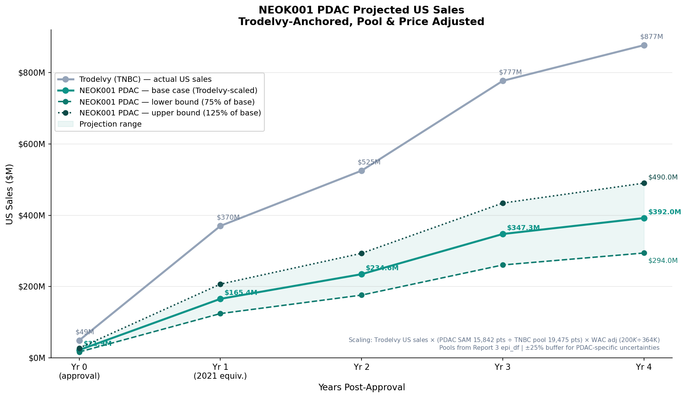

# Market Research - PDAC Commercial Opportunity Analysis
*Author: Yuying Fan | April 2026*  
*Full methodology and code: [`notebooks/4_market_research.ipynb`](../notebooks/4_market_research.ipynb)*  
*Primary indication, PDAC, was chosen for downstream analysis based on the previous indication scoring step ([Report 3](../reports/3_Indication_Scoring.md))*  
Primary Indication: PDAC | US Market

## 1. Objective
Evaluate the commercial opportunity for NEOK001 in the pancreatic ductal adenocarcinoma (PDAC) US market; the primary indication identified in Report 3.  

This will be done through:
- **ADC landscape benchmarking** — understand the approved ADC market and identify ADCs for benchmarking
- **Market sizing** — quantify TAM, SAM, and SOM using top-down and bottom-up approaches
- **Customer discovery** — define the unmet need, current SOC, and ideal product profile

 

## 2. Background
*Source: [[1](https://www.dualitybiologics.com/upload/listedco/listconews/sehk/2025/0407/11615076/2025040700036_c.pdf)]*  

The global ADC market has grown rapidly, from $2.0B in 2018 to $10.4B in 2023 (CAGR 38.6%), and is projected to reach $41.3B by 2028 (CAGR 31.8%)

The US ADC market specifically grew from $0.9B in 2018 to $5.1B in 2023 (CAGR 41.6%), and is forecast to reach $19.4B by 2028 (CAGR 30.9%).

NEOK001 is entering this market at an inflection point; the US ADC market is projected to more than triple from 2023 to 2028 - driven by new approvals, label expansions, and growing physician familiarity with ADC-based therapy.

PDAC ranked first in the indication scoring analysis, with the highest unmet need (2L+ mOS 4.2 months), least competitive ADC landscape (10 active Ph2/3 trials, 2 direct competitors), and a strong CPTAC protein expression confirmation. Critically, no approved ADC exists for pancreatic cancer so NEOK001 would enter a completely clear field within the fastest-growing ADC drug class in oncology.

This report will thus focus on analyzing the market for PDAC as NEOK001's primary Phase 1 indication.

---

### FDA-Approved ADC Landscape (as of 2026)
*Sources: [[1](https://pubmed.ncbi.nlm.nih.gov/40307936/)], [[2](https://www.biochempeg.com/article/427.html)], [[3](https://www.biochempeg.com/article/1462.html)]*

As of April 2026, 15 ADCs have received FDA approval across hematologic malignancies and solid tumors.

Understanding their targets, payloads, indications, and commercial trajectories provides critical context for the positioning of NEOK001

| Drug | Brand | Company | Target | DAR | Payload | Payload Class | FDA Approval | Indication | 2024 Global Sales [2] | 2024 US Sales [3] |
|------|-------|---------|--------|-----|---------|--------------|-------------|-----------|----------------------|------------------|
| Gemtuzumab ozogamicin | Mylotarg | Pfizer | CD33 | 2.5 | Calicheamicin | DNA damaging | 2000; 2017† | R/R AML | —* | —* |
| Brentuximab vedotin | Adcetris | Pfizer (ex-Seagen/Takeda) | CD30 | 4 | MMAE | Tubulin binder | 2011 | R/R HL, sALCL, MF, PTCL, DLBCL | $1.91B | ~$1.09B‡ |
| Trastuzumab emtansine | Kadcyla | Roche | HER2 | 3.5 | DM1 | Tubulin binder | 2013 | HER2+ BC, mBC | $2.32B | $888M |
| Inotuzumab ozogamicin | Besponsa | Pfizer | CD22 | 6 | Calicheamicin | DNA damaging | 2017 | R/R ALL | —* | —* |
| Moxetumomab pasudotox | Lumoxiti | AstraZeneca | CD22 | N/A | PE38 | Pseudomonas exotoxin | 2018; withdrawn 2023 | R/R HCL | Withdrawn | Withdrawn |
| Polatuzumab vedotin | Polivy | Roche | CD79b | 3.5 | MMAE | Tubulin binder | 2019 | R/R DLBCL | $1.30B | $659M |
| Enfortumab vedotin | Padcev | Pfizer (ex-Astellas/Seagen) | Nectin-4 | 3.8 | MMAE | Tubulin binder | 2019 | Urothelial carcinoma | $1.59B | $1.56B |
| Trastuzumab deruxtecan | Enhertu | AZ/Daiichi Sankyo | HER2 | 7.8 | DXd | **Topo-I inhibitor** | 2019 | HER2+ BC, GC, NSCLC; HER2-low BC | $3.75B | $1.86B |
| Sacituzumab govitecan | Trodelvy | Gilead | Trop-2 | 7.6 | SN-38 | **Topo-I inhibitor** | 2020 | TNBC, HR+/HER2- MBC | $1.32B | $902M |
| Belantamab mafodotin | Blenrep | GSK | BCMA | 4 | MMAF | Tubulin binder | 2020; reapproved 2025 | R/R MM | $2.52M¶ | Negative¶ |
| Loncastuximab tesirine | Zynlonta | ADC Therapeutics | CD19 | 2.3 | SG3199 (PBD) | DNA damaging | 2021 | R/R DLBCL | N/A§ | $69.3M§ |
| Tisotumab vedotin | Tivdak | Pfizer (ex-Seagen) | Tissue factor | 4 | MMAE | Tubulin binder | 2021 | R/R Cervical | $131M | $126M |
| Mirvetuximab soravtansine | Elahere | ImmunoGen/AbbVie | FRα | 3–4 | DM4 | Tubulin binder | 2022 | Pt-resistant ovarian | $479M | $477M° |
| Datopotamab deruxtecan | Datroway | AZ/Daiichi Sankyo | Trop-2 | ~8 | DXd | **Topo-I inhibitor** | 2025 | HR+/HER2- BC | N/A | N/A |
| Telisotuzumab vedotin | Emrelis | AbbVie | c-Met | 4 | MMAE | Tubulin binder | 2025 | NSCLC (c-Met high) | N/A | N/A |
---
_\* Pfizer does not disclose individual seperate sales for all nine of its hematology-oncology therapies_  
_† Mylotarg: originally approved 2000, withdrawn 2010, reapproved 2017_  
_‡ Adcetris global sales are reported by both Pfizer and Takeda ($1.09B & ~$822M in 2024, respectively). Pfizer holds US+Canada rights but US-only not separately disclosed_  
_¶ Blenrep was withdrawn 2022; 2024 sales negligible (£2M global and negative in US, per GSK Full-Year 2024 Press Release from 5 Feb 2025). Reapproved by FDA 2025 so sales resumed_  
_§ ADC Therapeutics sells Zynlonta directly only in the US; international sales handled through partners and reported separately. Value obtained from ADC Therapeutics SA 2024 Annual Report_  
_° Elahere US values obtained from AbbVie Q4 and Full-Year 2024 Financial Results Press Release from 31 Jan 2025_  

**Note:** 
- Cetuximab sarotalocan (Akalux, PMDA Japan) and Disitamab vedotin* (Aidixi, NMPA China) excluded — not FDA approved.
- Datroway and Emrelis approved 2025, post-publication of Wang et al. [1].

---

### ADC market context:
In 2024, top-selling ADCs were Enhertu ($3.75B), Kadcyla ($2.32B), Adcetris ($1.91B), Padcev ($1.59B), and Trodelvy ($1.32B)  
- No approved ADC targets ROR1 or B7-H3 → NEOK001 would be first-in-class for both targets
- No approved ADC exists for pancreatic cancer → NEOK001's potential primary indication has a completely clear field

---

### Key Structural Observations Relevant to NEOK001

**DAR (Drug-to-Antibody Ratio):**
Higher DAR = more payload molecules per antibody = more potent killing.

The most commercially successful recent ADCs use high DAR:
- Enhertu:  DAR 7.8 → $3.75B in 2024 — highest-selling ADC
- Trodelvy: DAR 7.6 → $1.32B in 2024 — base case benchmark
- Padcev:   DAR 3.8 → $1.59B in 2024 — lower DAR, MMAE payload  
- _NEOK001's DAR with the Synaffix SYNtecan-E linker is mentioned in their [[AACR 2026 poster abstract](https://www.abstractsonline.com/pp8/#!/21436/presentation/5396)]; DAR = 4_

**Linker technology:**
- Cleavable linkers (majority of modern ADCs) allow payload release in tumor microenvironment → better bystander effect
- Synaffix SYNtecan-E (NEOK001's linker) is a site-specific cleavable linker — same generation as Enhertu's proprietary linker

**Payload class trends:**
- Generation 1: DNA damaging (calicheamicin, PBD) — narrow use, harsh toxicity
- Generation 2: Tubulin binders (MMAE, DM1) — largest approved class
- Generation 3: Topo-I inhibitors (SN-38, DXd, exatecan) — fastest growing, highest DAR, bystander effect (NEOK001's class; most relevant for benchmarking)

 

## 3. Benchmark Selection for Market Sizing Estimates
Of the 15 approved ADCs, I will be benchmarking NEOK001's PDP launch against another ADC that could most closely match the expected launch conditions:

**Selection criteria:**
- Solid tumor indication (not hematology)
- Launched into setting with no prior approved ADC
- 2L+ line of therapy
- Similar or comparable addressable patient pool size

### Benchmark 1 — Trodelvy in TNBC
Most analogous to NEOK001:
- Same payload class: SN-38 is a Topo-I inhibitor, same as exatecan
- Launched into TNBC 2L+ with no prior approved ADC

**Commercial trajectory (from Gilead fiscal reports: [a](https://www.gilead.com/news/news-details/2022/gilead-sciences-announces-fourth-quarter-and-full-year-2021-financial-results), [b](https://www.gilead.com/news/news-details/2023/gilead-sciences-announces-fourth-quarter-and-full-year-2022-financial-results), [c](https://www.gilead.com/news/news-details/2024/gilead-sciences-announces-fourth-quarter-and-full-year-2023-financial-results))**  
| Year |Trodelvy US Sales |  Notes |
|------|----------|------|
| 2020 | $49M | Partial year (approved April 2020) |
| 2021 | $370M | First full year |
| 2022 | $525M | — |
| 2023 | $777M | — |
| 2024 | $877M | — |

---

### Benchmark 2 — Padcev in Urothelial
More aggressive launch trajectory:
- Launched into urothelial 2L+ with no prior approved ADC
- Strong Phase 3 data at approval → so faster physician adoption
- Was able to expand to 1L in 2023 → boosted sales significantly

**Commercial trajectory (from Seagen & Pfizer fiscal reports: [a](https://www.businesswire.com/news/home/20210211005849/en/Seagen-Reports-Fourth-Quarter-and-Full-Year-2020-Financial-Results), [b](https://www.businesswire.com/news/home/20220209005860/en/Seagen-Reports-Fourth-Quarter-and-Full-Year-2021-Financial-Results), [c](https://www.businesswire.com/news/home/20230215005723/en/Seagen-Reports-Fourth-Quarter-and-Full-Year-2022-Financial-Results), [d](https://lifesciencesbc.ca/members/seagen-third-quarter-2023-financial-results-reflect-strong-product-sales-growth-and-significant-portfolio-and-pipeline-progress/), [e](https://s206.q4cdn.com/795948973/files/doc_financials/2023/q4/Q4-2023-PFE-Earnings-Release.pdf))**  
| Year | Padcev US Sales | Notes |
|------|----------------|-------|
| 2019 | $0.2M | Partial year (approved Dec 2019) |
| 2020 | $222M | First full year |
| 2021 | $340M | - |
| 2022 | $451M | - |
| 2023 | ~$664M† | Pfizer acquired |
| 2024 | $1.56B | - |

_† 2023 US estimate: $479M (9M Seagen Q3 report) + ~$133M (Oct to Dec 14 acquisition est., 9M avg run rate × 2.5 months) + $52M (Pfizer acquired Dec 14)_  
_Note: Seagen Q4 earnings press releases is US-only as Seagen held US rights (ex-US rights held by Astellas and reported separately)_  

---

### Benchmark 3 — Elahere in Ovarian
More conservative trajectory:
- Launched into platinum-resistant ovarian 3L+ (a later line than NEOK001's likely 2L)
- Required companion diagnostic (FRα testing) — slowed the uptake
- Smaller patient eligible pool

**Commercial trajectory (from Immunogen and Abbvie fiscal reports: [a](https://news.abbvie.com/2023-03-01-ImmunoGen-Reports-Recent-Progress-and-2022-Financial-Results), [b](https://news.abbvie.com/2023-11-02-ImmunoGen-Reports-Recent-Progress-and-Third-Quarter-2023-Financial-Results)**
| Year | Elahere US Sales | Notes |
|------|-----------------|--------|
| 2022 | $2.6M | Partial year (approved Nov 14, 2022) |
| 2023 | ~$283M† | Based on Q3 report |
| 2024 | $477M | AbbVie acquired |

_† 9M Immunogen 2023 report was $212.1M but remaining Q4 2023 estimated at $70.7M (9M avg run rate × 3 months). Full year not reported; AbbVie acquired ImmunoGen Feb 2024._  

---

### **Benchmark Comparison**

| | Trodelvy (TNBC) | Padcev (Urothelial) | Elahere (Ovarian) | NEOK001 (PDAC est.) |
|-|----------------|--------------------|--------------------|---------------------|
| Payload class | Topo-I (SN-38) | MMAE | DM4 | Topo-I (exatecan) |
| Prior ADC in indication | None | None | None | None |
| Line of therapy | 2L+ | 2L+ | 3L+ | 2L+ |
| Companion dx required | No | No | Yes (FRα) | **Likely if co-expression correlates with response** |
| 2024 US sales | $877M | $1.56B | $477M | — |
| Role for NEOK001 | Base case (quantitative anchor) | Upper bound (no CDx) | Lower bound (CDx required) | — |

---

### Selection for Market Sizing

Trodelvy is retained as the **quantitative anchor** for revenue
projections — same Topo-I payload class, first ADC in indication,
2L+ positioning, no prior approved ADC.

However, Trodelvy's penetration was achieved without a patient
screening step and likely **overstates** NEOK001's achievable
penetration if a companion diagnostic is ultimately required.
A ±25% buffer is therefore applied around the Trodelvy-scaled base case to capture this uncertainty.

The buffer is conceptually anchored to two qualitative precedents:  
- **Elahere** as the CDx-adjusted floor: its slower ramp under required FRα testing is the most relevant precedent if NEOK001 ends up requiring dual ROR1/B7-H3 screening  
- **Padcev** as the upper-bound ceiling: its rapid uptake on strong Phase 3 data and 1L expansion is the most relevant precedent if NEOK001's bispecific selectivity broadens the eligible population  
Neither Elahere nor Padcev is used as a quantitative scaler; the ±25% range is judgment-based, informed by the directional trajectories of these benchmarks rather than computed from their penetration rates.

 

## 4. Dosing & Annual WAC - NEOK001 Assumption
We already have estimates on addressable patient population (mTNBC for Trodelvy; mPDAC for NEOK001) from Report 3 (& `3_indication_scoring.ipynb`). However, the indication scoring in Report 3 (& `3_indication_scoring.ipynb`) used the **full 1L metastatic pool** (incidence × % metastatic) as the addressable patient estimate - representing  the long-term commercial opportunity assuming eventual label expansion, consistent with ADC class precedent (e.g. Enhertu, Trodelvy, Padcev; all 
expanded from later to earlier lines post-approval).

For revenue projections in this section, we'll use a more conservative **2L+ SAM** as it's the realistic near-term entry point for NEOK001 as a first-in-human Phase 1 asset entering a setting where patients have already received at least one prior line of therapy. This reflects where NEOK001 will most likely receive its initial approval, before any label expansion data exists.

This revenue section will use two pools:
- **Near-term (2L+ SAM):** `67,530 (incidence) × 51% (metastatic) × 50% (reaching 2L+) × 92% (ROR1 detected, CPTAC) = ~15,842 pts/yr`
   - 92% applies a biomarker prevalence discount based on CPTAC (92% ROR1, 100% B7-H3)

- **Long-term (1L expansion):** `full mPDAC pool = 34,440 pts/yr` 
   — same as Report 3

The missing input for scaling is the annual WAC — for both Trodelvy (benchmark) and NEOK001 (assumption). These are derived below. We will also look at the WAC for the other previous benchmark candidate Padcev, to get a better understanding on the range in ADC prices; as well as the WAC for Onivyde (Current PDAC 2L+ SOC, chemotherapy)

### Trodelvy (Sacituzumab govitecan)
*Source: [Gilead Sciences WAC disclosure](https://www.gileadpriceinfo.com/trodelvy) (as of 1 Jan 2026) ; [drugs.com Dosage Information](https://www.drugs.com/dosage/trodelvy.html) (as of 31 Mar 2025)*

> Dosing: 10 mg/kg on Days 1 and 8 of 21-day cycle (2 infusions/cycle)  
> WAC per cycle: $20,918 (2 infusions)  
> 
> Per infusion: $20,918 ÷ 2 = $10,459  
> Dose per infusion: 10 mg/kg × 72 kg = 720 mg  
> Vials per infusion: 720 mg ÷ 180 mg = 4 vials  
> Cost per vial: $10,459 ÷ 4 = $2,615/vial  
> Cost per cycle: $10,459 × 2 infusions = $20,918  
> Cycles per year: 365 ÷ 21 = 17.4  
> Annual WAC: $20,918 × 17.4 = **about $364K/yr**

---

### Padcev (Enfortumab vedotin) — Single Agent 2L+
*Source: [Pfizer CT WAC disclosure](https://cdn.pfizer.com/pfizercom/products/ctprescribers/PADCEVCTPriceDisclosureShortForm01092026.pdf) (as of 9 Jan 2026) ; [drugs.com Dosage Information for combination use](https://www.drugs.com/dosage/padcev-injection.html) (as of 21 Nov 2025)*  

> Dosing: 1.25 mg/kg on Days 1, 8, and 15 of 28-day cycle (3 infusions/cycle)  
> WAC per vial: $4,213.50 (30mg single-dose vial)  
> 
> Dose per infusion: 1.25 mg/kg × 72 kg = 90 mg  
> Vials per infusion: 90 mg ÷ 30 mg = 3 vials  
> Cost per infusion: 3 × $4,213.50 = $12,640.50  
> Cost per cycle: $12,640.50 × 3 infusions = $37,921.50  
> Cycles per year: 365 ÷ 28 = ~13  
> Annual WAC: $37,921.50 × 13 = **about $493K/yr**

---

### Onivyde (Irinotecan liposomal) — Current PDAC 2L+ SOC
*Source: [drugs.com Price](https://www.drugs.com/price-guide/onivyde) and [Dosage Information](https://www.drugs.com/dosage/irinotecan-liposomal.html) (as of 3 April 2026)*

> Dosing: 70 mg/m² IV every 2 weeks (Q2W), in combination with 5-FU/leucovorin  
> WAC per vial: $1,868.86 (10mL, 4.3 mg/mL = 43mg per vial)  
> 
> Dose per infusion: 70 mg/m² × 1.7 m² (standard BSA) = 119mg  
> Vials per infusion: 119mg ÷ 43mg = 2.77 → 3 vials  
> Cost per infusion: 3 × $1,868.86 = $5,606.58  
> Infusions per year: 365 ÷ 14 = ~26  
> Annual WAC: $5,606.58 × 26 = **about $146K/yr**

---

### NEOK001 (for PDAC) — WAC Assumption
Dosing schedule not yet established (Phase 1 ongoing)
Assumed: single infusion Q3W (common ADC schedule)

**WAC assumption: ~$200K/yr**

<u>Rationale:</u>
- Premium over Onivyde (~$146K/yr) → as ADC vs. chemo and NEOK001 would be first-in-class targeted mechanism
- Conservative vs. Trodelvy ($364K/yr, 2 doses/cycle) and Padcev ($493K/yr, 3 doses/cycle) → as both dose more frequently than assumed schedule for NEOK001
- Assume discount from Trodelvy to reflect likely earlier clinical stage at launch (Ph1/2 not Ph3) → pricing pressure vs fully approved Phase 3-supported ADCs

 

## 5. Revenue Trajectory
*Trodelvy-anchored 5-year post-approval projection*

  

*NEOK001 projected US sales (2L+ SAM, Years 0–4 post-approval), scaled from Trodelvy TNBC trajectory adjusted for PDAC pool size and WAC difference. Year 4 base case ~$392M (range ~$294M–$490M). ±25% range reflects PDAC-specific clinical and market uncertainties. Year 0 corresponds to a partial-year launch equivalent to Trodelvy's April 2020 approval.*

 

## 6. Market Sizing (TAM / SAM / SOM)

### TAM - Total Addressable Market
All US PDAC patients annually, if NEOK001 were used across all stages:

| Metric | Value |
|--------|-------|
| Annual PDAC incidence (US) | 67,530 | 
| Annual WAC assumption | ~$200K |
| **TAM** | **~$13.5B** | |

---

### SAM — Serviceable Addressable Market
Two SAM estimates reflecting near-term 2L+ entry and long-term 1L expansion:

| Metric | Value | 
|--------|-------|
| Metastatic PDAC patients/yr | ~34,440 (67,530 × 51% metastatic) |
| % reaching 2L+ therapy | ~50% |
| ROR1 detection rate (CPTAC) | 92% |
| Annual WAC assumption | ~$200K |
| **SAM - near-term (2L+)** | **~$3.2B** (15,842 pts × $200K) |
| **SAM - long-term (1L expansion)** | **~$6.9B** (34,440 pts × $200K) |

> Near-term SAM applies a ROR1 biomarker prevalence discount (92%
> CPTAC detection in PDAC). Note this does not model co-expression
> of both ROR1 and B7-H3 simultaneously — true addressable patients
> require tumor expression of both targets. For PDAC specifically,
> the co-expression impact is minimal (ROR1 92% × B7-H3 100% ≈ 92%
> under independence assumption). A formal companion diagnostic
> selecting dual-positive patients would further refine this estimate.
> See Limitation note in Section 7.

---

### SOM — Serviceable Obtainable Market
Realistic peak market share based on near-term 2L+ SAM (~$3.2B), scaled from Trodelvy benchmark penetration:

| Scenario | Market Share | Patients/yr | Peak Annual Revenue | Reference |
|----------|-------------|------------|-------------------|-----------|
| Conservative | 5–8% of SAM | ~800–1,300 | ~$160M–$250M | Elahere-paced (CDx required, slower ramp) |
| Base case | 10–15% of SAM | ~1,600–2,400 | ~$320M–$480M | Trodelvy benchmark (~12%) ± analog uncertainty |
| Upper bound | 18–25% of SAM | ~2,900–4,000 | ~$570M–$790M | Outperforms Trodelvy on bispecific selectivity rationale |

**Base case rationale:**  
Trodelvy achieved ~12% SAM penetration in TNBC by Year 4 post-approval
(~2,410 patients treated out of ~19,475 addressable)
- 19,475 addressable → 48,687 TNBC incidence × 40% metastatic eligible, from Report 3 (`3_indication_scoring.ipynb`)
- 2,410 patients treated → $877M Year 4 US sales ÷ $364K annual WAC 

---

### Summary
| Metric | Pool | Patients/yr | WAC | Value |
|--------|------|------------|-----|-------|
| TAM | All PDAC (all stages) | 67,530 | $200K | ~$13.5B |
| SAM (near-term, 2L+) | 2L+ eligible mPDAC | ~15,842 | $200K | ~$3.2B |
| SAM (long-term, 1L) | Full mPDAC (1L expansion) | 34,440 | $200K | ~$6.9B |
| SOM - conservative | 5–8% of near-term SAM | ~800–1,300 | $200K | ~$160M–$250M |
| SOM - base case | 10–15% of near-term SAM | ~1,600–2,400 | $200K | ~$320M–$480M |
| SOM - upper bound | 18–25% of near-term SAM | ~2,900–4,000 | $200K | ~$570M–$790M |

 

## 7. Limitations

**1. Co-expression not modeled in SAM**
The near-term SAM applies a single-target biomarker discount (ROR1
92% CPTAC detection) but does not model co-expression of both ROR1
and B7-H3 simultaneously. NEOK001's bispecific mechanism requires
tumor cells to co-express both targets for full bispecific engagement.
Per-patient co-expression data would require multiplex IHC or
single-cell proteomics — not available from current CPTAC or TMA
data. For PDAC the impact is minimal given near-universal B7-H3
detection (100% CPTAC), but for other indications with lower dual
detection rates the SAM overstatement could be substantial.

**2. Companion diagnostic uncertainty**
Whether NEOK001 will require a CDx is unknown until Phase 1/2
response data is available. ROR1 and B7-H3 are frequently
co-expressed in solid tumors — if clinical response correlates
strongly with co-expression level, FDA will likely require a CDx
to select dual-positive patients, consistent with Elahere's
FRα IHC requirement. This would reduce effective SAM and slow
physician adoption relative to the Trodelvy-anchored base case.
Preclinical tolerability data is encouraging — HNSTD of 60 mg/kg
in NHP (AACR 2026) suggests a wide therapeutic window that may
reduce CDx urgency if efficacy is achievable at lower doses in
broader populations.

**3. WAC assumption is speculative**
NEOK001's dosing schedule is not yet established. The $200K/yr
WAC assumption reflects a single Q3W infusion — actual pricing
will depend on Phase 1/2 data, competitive landscape at approval,
and payer negotiations.

**4. Trodelvy penetration back-calculation overstates TNBC 2L+ uptake**
The ~12% SAM penetration estimate for Trodelvy was derived by
dividing Year 4 US sales ($877M) by annual WAC ($364K) to estimate
patients treated (~2,410), then dividing by the addressable pool
(~19,475 TNBC 2L+ patients). However, by Year 4 (2024), Trodelvy
had expanded to 1L mTNBC and to HR+/HER2- MBC — patients in the
numerator span multiple lines and indications, while the denominator
is the original TNBC 2L+ pool only. The true Year-4 penetration in
the directly-comparable launch setting (TNBC 2L+) was almost
certainly lower than 12%. Using ~12% as the base case midpoint
is therefore optimistic; the lower-bound scenario partially absorbs
this bias.

 

