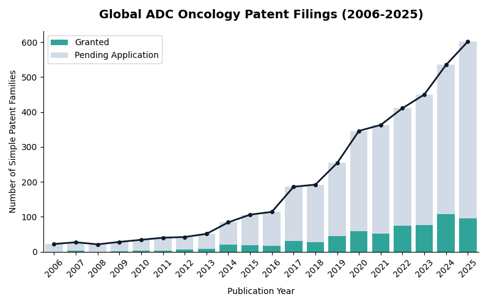
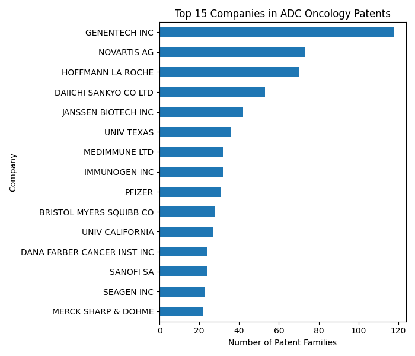
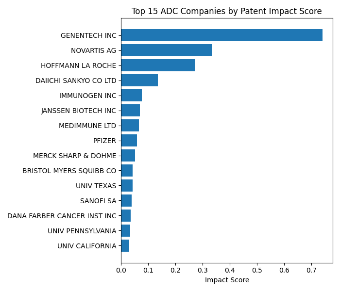
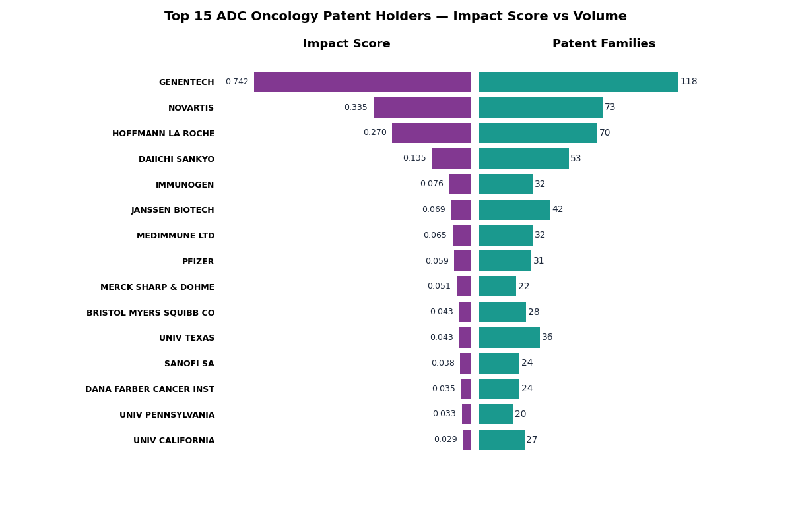
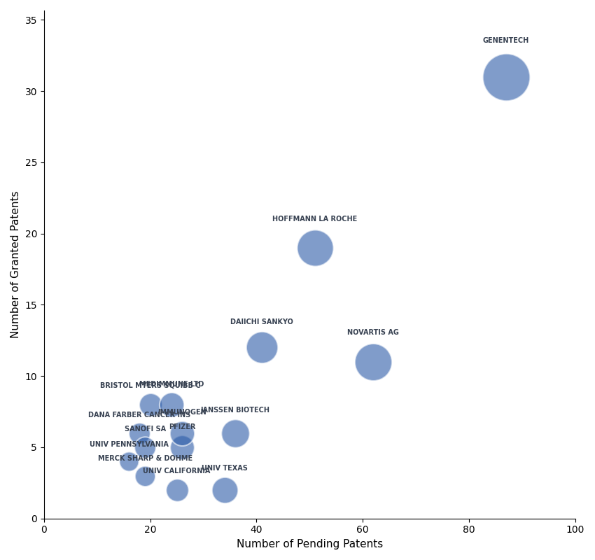
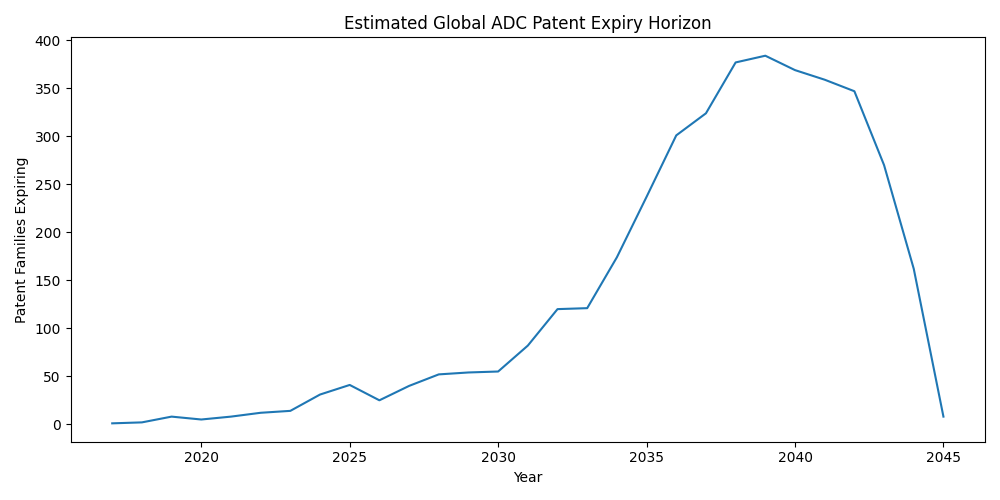

# IP Landscape (A): Global ADC Oncology Patent Landscape
*Author: Yuying Fan | April 2026*  
*Part of the three-part IP analysis in #5*
*Full methodology and code: [`notebooks/5_ip_portfolio/5a_global_adc_oncology_landscape.ipynb`](..notebooks/5_ip_portfolio/5a_global_adc_oncology_landscape.ipynb)*   
Global Patent Analysis | Top Companies in the ADC Oncology space

## 1. Objective
Map the global ADC oncology patent landscape to identify the most active and influential companies, filing trends over time, and the competitive intensity of the broader ADC oncology space that NEOK001 would be entering.

This will be done through:
- **Filing trend analysis** - Number of global patent family counts by year (2006–2026), categorized into pending and active
- **Volume ranking** - The top assignees by raw numeric patent family counts
- **Impact scoring** — A composite metric weighting based on simple family size,forward citations, jurisdiction breadth, and legal status to identify foundational patent holders (beyond volume alone)
- **Granted vs pending analysis** — portfolio maturity assessment across these top scored assignees

<br>
<hr style="border: 2px solid black;">

## 2. Patent Search Methodology and File Prep
Patent data was retrieved from Lens.org to understand the global antibody-drug conjugate (ADC) oncology landscape and competitive field

### Search Query
Patents: `class_cpc.symbol:(A61P35*) AND (class_cpc.symbol:(C07K16*) OR class_cpc.symbol:(C07K2317*)) AND (class_cpc.symbol:(A61K2039*) OR class_cpc.symbol:(A61K47*)) AND (class_cpc.symbol:(C07D*) OR class_cpc.symbol:(A61K31*))`

#### <u>Rationale:</u>
CPC filters were used for:  
    A) Oncology indiciation (A61P35/*) -> Inventions for cancer treatments  
    B) Immunoglobulins (C07K16/* or C07K2317/*) -> Therapeutic agent is antibody-related  
    C) Chemical conjugation/linker (A61K2039/* or A61K47/*) -> Antibody is chemically linked to another compound (ADC)  
    D) Cytotoxic payload (C07D* or A61K31/*) -> Uses cytotoxic drug as payload  
<br>

Filters: `Published Date = (2006-01-01 - 2026-02-24) Expanded by Simple Families Document Type = (Patent_application, Granted_patent) Legal Status = (Pending, Active)`
- Date Range: Filtered by years of 2006 to 2026; want to look at current competitive space with 20 year term blackout window
- Document Type = Patent application and Granted patent
- Legal Status: Active, Pending

#### <u>Output:</u>
This will result in 36,656 patent records
- Made of 3,982 Simple Families and 3,849 Extended Families
- Select the 3,982 simple family and file was saved as `Global-ADC-Oncology-Patent-Landscape-01_01_2006-02_24_2026.csv`  

**This file will be examined first to get a broad understanding of the global patent space**

> ### Terminology — Patent Families
> All filings/applications for the same _invention_ comprise a patent family.
>  
> **Simple family**  
> From The Lens: "A simple patent family is a group of patent documents that stem from the same initial document, called the priority document."
> - All members share the same priority or combination of priorities  
> - Acts as “equals” of the invention  
> - E.g. identical filings in different countries  
>  
> **Extended family**  
> From The Lens: "An extended family is a collection of patent applications that stem from similar technical content."
> - Any member shares at least one priority with at least one other member  
> - Includes variations, continuations, improvements

<br>

> **Note - This Lens search captures patents with **explicit payload CPC classification (A61K31*/C07D*)**
> - ADCs indexed solely under conjugate codes (A61K47*) without separate payload classification (such as MacroGenics US 10961311) will fall outside this search scope
> - Core overall landscape findings remain valid; a payload-agnostic supplementary search is recommended for comprehensive FTO

<br>
<hr style="border: 2px solid black;">

## 3. Filing Trends (2006–2026)

  

> Note: 
> Patent applications are published 18 months from earliest priority date. Due to this 18-month publication delay of patent applications, filings from 2025–2026 may be underrepresented in public databases like Lens. Therefore, 2024 & 2025 numbers should be interpreted cautiously
> Search limited to patents with explicit payload CPC classifications.
>

To set the stage, the global ADC patent space has grown dramatically in recent years; going from under 30 filings in 2006 to over 600 in 2025. There’s also a high proportion of pending applications, seen in the grey sections of each bar.  
So NEOK Bio (and ABL Bio) are in a highly competitive and quickly growing area of the Oncology IP landscape. This signals both strong commercial interest but also an urgency of establishing IP position & strategy early on.

<br>
<hr style="border: 2px solid black;">

## 4. Top Assignees Globally - Volume vs Impact
Two methods were used for evaluating competitive position:
1) **Volume**: A raw patent family count, reflects breadth of filing activity
2) **Impact Score**: A composite score metric that takes into account portfolio quality, not just the volume/quantity

**Impact Score methodology:**

| Metric | Rationale |
|--------|-----------|
| Simple family size | Jurisdiction breadth - how widely protected |
| Forward citations | Industry recognition - cited by others |
| Jurisdiction count | Geographic reach |
| Legal status score | Active = 1.0, Pending = 0.5 |

All four metrics were min-max normalized (0–1), averaged per company, then multiplied by a portfolio weight (company family count ÷ max family count; this prevents a single high-value outlier from dominating the ranking)

```python
impact_score = norm.mean(axis=1) × (family_count / max_family_count)
```

#### **Top 15 Companies based on Volume**

  


#### **Top 15 Companies based on Impact Score**
  

### <u>Observations:</u> 
Volume rank and impact rank diverge for several companies. For example, Genentech leads both and industry companies remain high; Some academic institutions rank high on volume but decrease in rank on impact, likely due to smaller family sizes and fewer citations.

<br>
<hr style="border: 2px solid black;">

## 5. Top 15 Assignees based on Impact Score

Examining the top 15 assignees (based on impact score) further for volume and legal status

### **Volume vs Impact Score**

  

### **Granted vs Pending Analysis**

  

<br>
<hr style="border: 2px solid black;">

## 6. Global Expiry Horizon
*Estimated expiry dates calculated as priority date + 20 years across all 3,983 ADC oncology simple families in the global dataset. Actual expiry timeline may differ due to patent term extensions, terminal disclaimers, maintenance fee abandonment, continuation filings, etc.*


### <u>Observations:</u>

**2019–2030 — Low expiry volume:**  
The current competitive landscape is relatively stable and few foundational patents expiring in the near term. NEOK001 enters a space where key competitor IP is still largely active

**2030–2040 — Expiry acceleration:**  
Significant wave of ADC oncology patents begin expiring (likely primarily those filed during the 2010–2020 climb in ADC activity).
It could creates a progressive opening in freedom-to-operate as composition and platform patents expire.

**Peak ~2038–2040:**  
Largest cohort of expiring families, likely corresponding to patents filed around 2018–2020, highest global ADC filing activity

**Strategic implication:**  
NEOK001's Phase 1 timeline (2026) and projected approval window (2030+) coincides with the beginning of this expiry acceleration phase for early ADC-patents. This warrants further investigation into which specific early platform and linker-payload patents are expiring; and whether NEOK001's construct falls within their scope, as part of ongoing FTO monitoring during clinical development

<br>
<hr style="border: 2px solid black;">

## 7. Limitations

- Patent applications are published 18 months from earliest priority date. Due to this 18-month publication delay of patent applications, filings from 2025–2026 may be underrepresented in public databases like Lens. Therefore, 2024 & 2025 numbers should be interpreted cautiously
- Search limited to patents with explicit payload CPC classifications in Lens. CPC-based filtering could also miss key players that are missing or avoid ADC-specific classifications


<br>
<hr style="border: 2px solid black;">