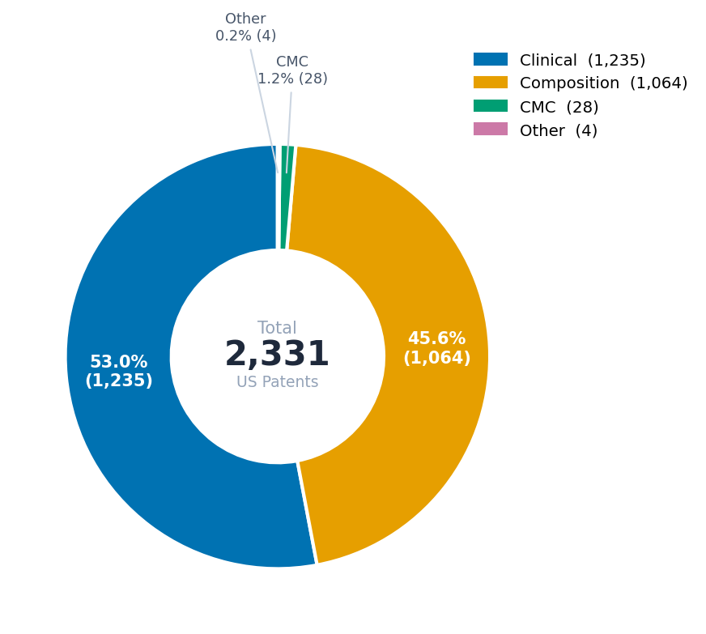
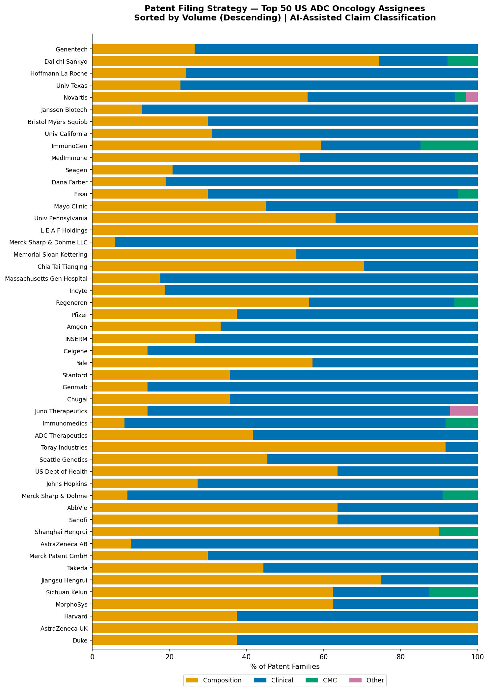
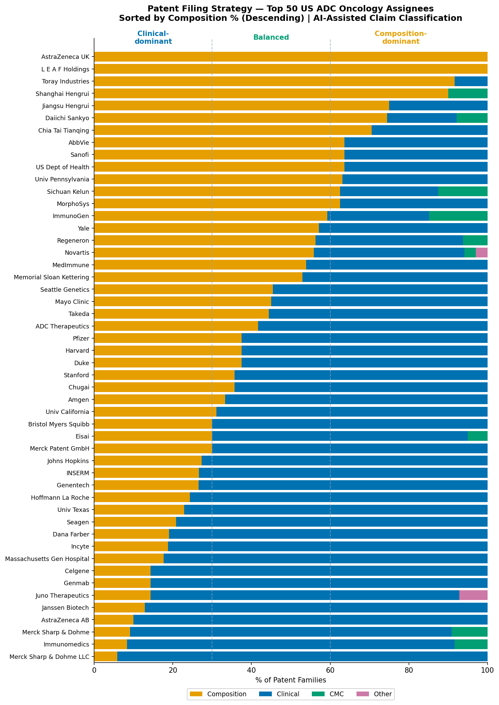
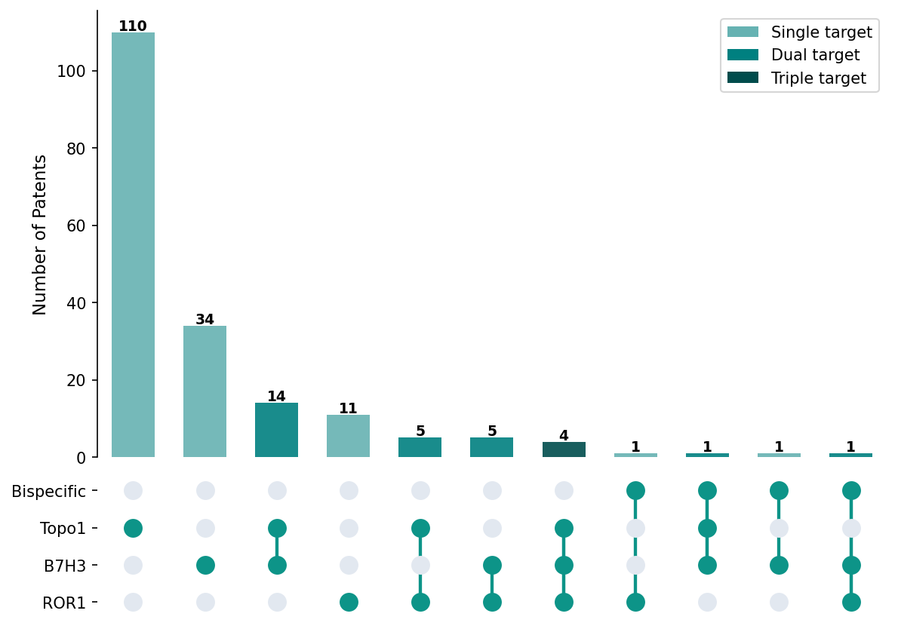
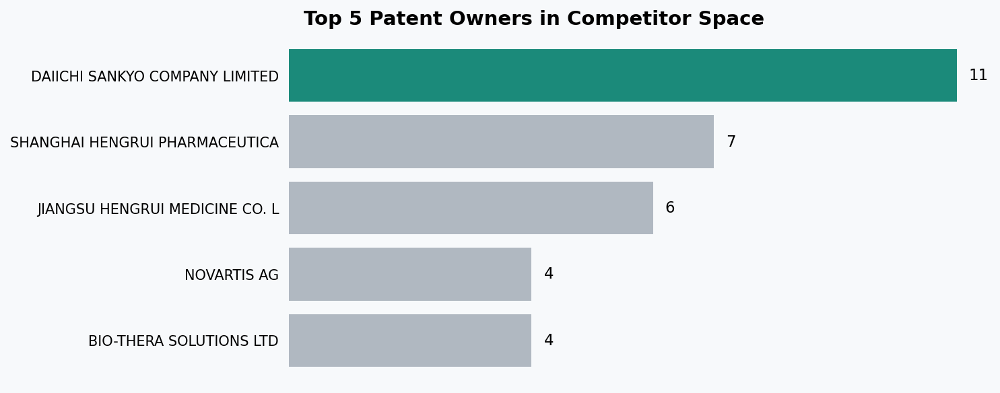
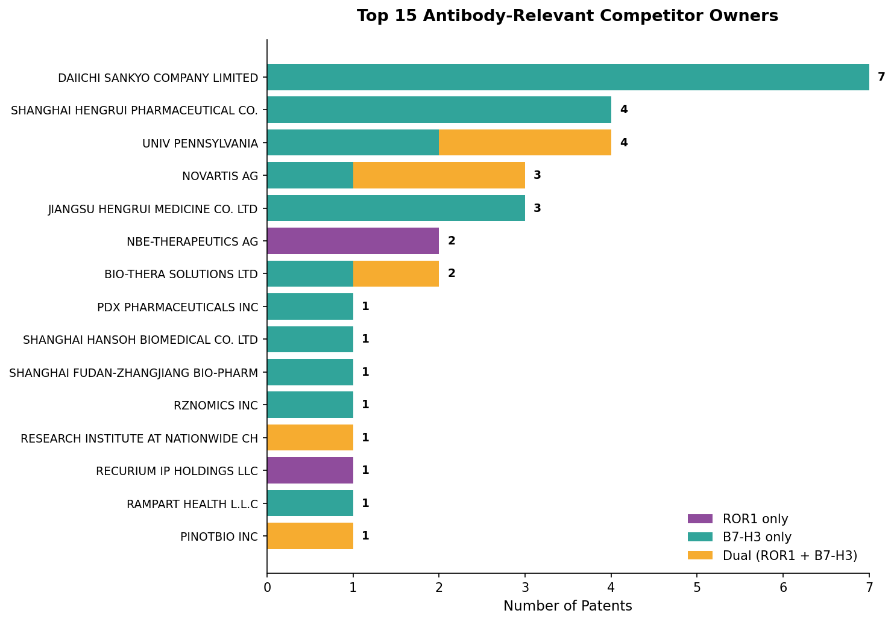

# IP Landscape (B): US ADC Patent Landscape - Claim-Based Analysis & Technical Competitors
*Author: Yuying Fan | April 2026*  
*Part of the three-part IP analysis in 5_ip_portfolio (a,b,c)*
*Full methodology and code: [`notebooks/5_ip_portfolio/5b-1_direct_us_patents.ipynb`](../notebooks/5_ip_portfolio/5b-1_direct_us_patents.ipynb) and [`notebooks/5_ip_portfolio/5b-2_technical_competitors.ipynb`](../notebooks/5_ip_portfolio/5b-2_technical_competitors.ipynb)*   
US Patent Analysis | Claims-based AI Classification of ADC Oncology Patents | Competitor Identification

## 1. Objective
Analyze the US ADC oncology patent landscape at the claim level to understand what competitors are actually protecting, not just the title or the topic they are filing about.

This is done through:
- **Claim-based classification** - Using AI API for bulk classification using claims text across 2,331 US ADC oncology patents; to distinguish composition, clinical, or CMC filings types
- **Assignee breakdown** — examine patent type distribution across top competitors to reveal filing strategy differences and patterns
- **Technical space analysis** — targeted identification of US patents with claims overlapping NEOK001's ROR1×B7-H3 bispecific ADC construct; using AI API on claims to detect strategic drafting that obscures target names in titles and/or abstracts

 

## 2. File Prep - US Jurisdiction

I moved onto the `US-enforced-patents.jsonl` file, which focused on the US patent records
- This has also already been narrowed down to ADC Oncology related by specifying the CDCs in The Lens search
  - Added to the search query mentioned in [5a_IP_Global_ADC_Landscape](5a_IP_Global_ADC_Landscape.md), the additional query term of: `AND jurisdiction: US`
- Results in 5,783 Patent Records; with 2,331 Simple Families and 2,265 Extended Families
- The 2,331 families, which would be all active or pending patent records with jurisdiction in the US that are ADC Oncology related, was saved as `US-enforced-patents.jsonl`

The jsonl file was used to get claims column
- This is because when bulk exporting as a csv from The Lens, only text you will get back is Title and Abstract columns
- A lot of patents will try to hide from competitors, making titles and abstracts vague
- Therefore, the jsonl file, which contains the claims, was used for subsequent analysis

 

## 3. Examining Claims and Methodology
The US-enforced patents were analyzed using **claims text** rather than just title or abstract, and no specifications

**Focus on Claims, the Legally Enforceable Scope**  
This project will focus on the claims section, which defines the legally enforceable scope of protection
- Title and Abstract is still included in the input but companies may try to avoid alerting competitors and use more general terminallogy
- Specification text will not be used due to length but also you'll see occurences with broad and wide mentions like:  
   - _"[0339] The cancer cell target antigen may be, for example, 5T4, ABL, ABCF1, ACVR1, ACVR1B, ACVR2, ACVR2B, ACVRL1, ADORA2A, AFP, Aggrecan, AGR2, AICDA, AIF1, AIGI, AKAP1, AKAP2, ALCAM, ALK, AMH, AMHR2, ANGPT1, ANGPT2, ANGPTL3, ANGPTL4, ANPEP, APC, APOCl, AR, aromatase, ASPH, ATX, AX1, AXL, AZGP1 (zinc-a-glycoprotein), B4GALNT1, B7, B7.1, B7.2, B7-H1, B7-H3, B7-H4, B7-H6, BAD, BAFF, BAG1, BAIl, BCR, BCL2, BCL6, BCMA, BDNF, BLNK, BLR1 (MDR15), BIyS, BMP1, BMP2, BMP3B (GDFIO), BMP4, BMP6, BMP8, BMP10, BMPR1A, BMPR1B, BMPR2, BPAG1 (Plectin), BRCA1, C19orflO (IL27w), C3, C4A, C5, C5R1, CA ...."_  
    - Searching or classifying on this text will generate substantial noise.

---

### **AI-Assisted Claim Classification**:
I will be using AI-assisted claim classification on these 2331 patents to classify into patent types
- This will provide a larger overview of types of patents being pursued by various competitors

> **Note**:
> - Patents do not contain an official “type” category (and can be mixed/hybrid)
> - Instead, this classification will be derived from analysis of the broadest independent claim to determine the dominant functional category of the filing

### 3.1 Methodology

> **AI API Code Portion:**
The AI-classification code portion was executed within a course-provided git environment (with OpenAI API gateway key and pre-configured dependencies). But the full code and output is included in the associated 5b notebook.

**Input preparation:**
Full claims text was extracted from `US-enforced-patents.jsonl` and provided to the model alongside title and abstract. The model was instructed to classify based on the **broadest independent claim**.

> **Scope limitations:**
Claims referencing SEQ ID NO, chemical structures, or figures were submitted as-is (just the text in claims section); sequence tables and structural images were not parsed in, as this would increase token length significantly and image-to-text requires additional preprocessing complexity beyond the scope of this individual project.

> **Validation:**
Before running on the full US patent dataset, the pipeline was validated on a manually curated subset of ABL Bio patents (n=24) before large-scale classification. *See `data/processed/abl_patents_for_ai.csv` for the exact patent list.* This allowed prompt testing and iterative refinement before the large-scale classification.

### 3.2 Classification

Each patent was classified using a two-step hierarchical schema applied to the **broadest independent claim:**

**Step 1 — Primary patent type (mutually exclusive):**

| Type | Definition |
|------|-----------|
| **Composition** | Drug, biologic, ADC construct, antibody, linker, payload, or therapeutic composition |
| **CMC** | Manufacturing, conjugation, DAR control, purification, formulation, or analytical methods |
| **Clinical** | Treatment methods, dosing regimens, patient populations, or combination therapies |
| **Other** | Does not primarily fall into above categories |

**Step 2 — Subtype classification (type-dependent):**

*Composition subtypes:* Full ADC / Conjugated Linker / Conjugated
Payload / Conjugated Antibody / Dual Combination / Unconjugated
Linker / Unconjugated Antibody / Unconjugated Payload

*CMC subtypes:* DAR Control / Conjugation Method / Process & Scale-Up /
Purification & Downstream / Formulation & Stability /
Analytical & Characterization / Intermediate Production

*Clinical:* Disease indications and patient populations extracted only if explicitly claimed

### 3.3 Model Selection — GPT-4o vs GPT-4o-mini

Both models were evaluated on the ABL Bio validation sub set with 3 prompt versions:

- **v1** — baseline prompt; macro-level classification stable but composition subtypes weak in mini model
- **v2** — it refined mini's subtypes but mini now overcalled clinical (over-prioritized method-of-treatment claims even when a composition claim was broader)
- **v3** — added explicit Claim 1 priority rule (*"If Claim 1 claims a molecule, antibody, ADC, or construct → classify as Composition; only classify Clinical if Claim 1 itself is a method-of-treatment claim"*). This stabilized Composition vs Clinical boundary at the cost of being structurally conservative (conjugation language in later independent claims may be missed)

`temperature=0` used throughout for deterministic, reproducible output

Using the v3 prompt, comparisons was that:

| Capability | GPT-4o | GPT-4o-mini |
|-----------|--------|-------------|
| Macro-level type classification | ✅ Strong | ✅ Stable |
| Composition subtype accuracy | ✅ Accurate | ⚠ Degraded |
| Clinical indication extraction | ✅ Good | ✅ Improved |
| Structural reasoning consistency | ✅ Consistent | ❌ Contradictory |

GPT-4o-mini showed conceptual drift in structural subtype classification
- Some plain antibodies and bispecific antibodies were labeled as "Conjugated Antibody" even when no linker or payload was present, with self-contradictory reasoning from the model
- But macro-level classification (Composition / Clinical / CMC) remained stable across both models

**For purpose:**  
The mini classification is sufficient for portfolio-level categorization; understanding the distribution of composition vs clinical vs CMC filings across competitors. The mini model is also quicker and cheaper to implement.

_Note that this model would not be sufficient for Freedom-to-Operate analysis, invalidity assessment, or platform IP in-depth evaluation_

> Therefore, GPT-4o-mini was selected for final classification and the classification result can be found `data/ai_results/patents_classified_v3mini.csv`

 

## 4. US ADC Patent Landscape - Overall Findings

### Patent Type Distribution

Overall Patent Type Distribution

| Patent Type | Count | % |
|-------------|-------|---|
| Clinical | 1,235 | 53.0% |
| Composition | 1,064 | 45.6% |
| CMC | 28 | 1.2% |
| Other | 4 | 0.2% |

The US ADC oncology landscape is nearly evenly split between clinical (53.0%) and composition (45.6%) filings - reflecting a field that is simultaneously building construct-level IP as well as layering indication-specific use claims on top of it

However, composition filings remain substantial (45.6%), reflecting continued
platform-level and construct-level IP activity.  

Manufacturing IP (CMC) is minimal (1.2%), suggesting the process know-how may be primarily protected through trademarks and patent competition is currently concentrated at the molecule and clinical positioning level rather than on the process. 

### Legal Status

| Patent Type | Granted | Pending |
|-------------|---------|---------|
| CMC | 32.1% | 67.9% |
| Clinical | 24.5% | 75.5% |
| Composition | 24.3% | 75.7% |
| Other | 0.0% | 100.0% |

**Overall: 570 granted and 1,761 pending (so ~75% still pending)**

| Year | Granted | Pending | Grant Rate |
|------|---------|---------|------------|
| 2006–2017 | Low volume | Low volume | ~30–42% |
| 2018 | 34 | 46 | 42.5% |
| 2019 | 42 | 85 | 33.1% |
| 2020 | 59 | 78 | 43.1% |
| 2021 | 45 | 147 | 23.4% |
| 2022 | 82 | 218 | 27.3% |
| 2023 | 72 | 318 | 18.5% |
| 2024 | 63 | 334 | 15.9% |
| 2025 | 74 | 333 | 18.2% |

The overall space is in an active expansion phase, with ~75% of filings across all types still pending; reflecting a recent filing wave (surge seen starting ~2021) that has not yet matured through prosecution. Composition and clinical filings are growing in parallel, with no maturity gap seemingly between them.

Not yet in a mature environment where foundational IP is already locked down. Core platform architecture is not monopolized; have many players still advancing assets in parallel, with most protection still pending.

 

## 5. Patent Strategy by Top Assignees (US ADC Oncology Patents)

Next, narrowing this scope down to looking at the top companies filing patents in US ADC oncology space (volume based)

### Top Assignees by Volume 

| Rank | Assignee | Simple Patent Families |
|------|----------|----------------|
| 1 | Genentech Inc | 79 |
| 2 | Daiichi Sankyo Co Ltd | 51 |
| 3 | Hoffmann La Roche | 37 |
| 4 | Univ Texas | 35 |
| 5 | Novartis AG | 34 |
| 6 | Janssen Biotech Inc | 31 |
| 7 | Bristol Myers Squibb Co | 30 |
| 8 | Univ California | 29 |
| 9 | ImmunoGen Inc | 27 |
| 10 | MedImmune Ltd | 26 |

*Top 10 assignees collectively account for ~16% of all 2,331 US ADC oncology patent families*

**Observations:**
- **Genentech leads by a wide margin** (79 families) - nearly 1.5x
  the next closest filer (Daiichi Sankyo, 51)
- **Hoffmann La Roche (#3) is Genentech's parent company** — So combined Roche+Genentech portfolio totals ~116 families, making the Roche group the dominant single corporate entity in the US ADC IP space
- **Academic institutions are also prominent** — Univ Texas (#4) and Univ California (#8) both rank in the top 10
- **ImmunoGen/MedImmune** - were acquired by large pharmas (AbbVie & AstraZeneca respectively); so these patent portfolios are now within much larger corporate entities, concentrating IP further than this raw assignee names would suggest

### Patent Composition in Top 50 US ADC Filers
> *Note: Top 50 here refers to highest-volume assignees in the US-enforced patent families*

  

*Figure: Patent type breakdown across top 50 US ADC oncology assignees by family count, sorted by volume (descending). Patent type based on AI-assisted classification from title, abstract and independent claims text. Dashed lines at 30% and 60% mark archetype boundaries.*

*Figure: Patent type breakdown across top 50 US ADC oncology assignees by family count, sorted by composition percent (descending). Patent type based on AI-assisted classification from title, abstract and independent claims text. Dashed lines at 30% and 60% mark archetype boundaries.*

**So seperating in three filing archetypes:**
- Composition-dominant: primarily building construct-level and platform IP in the US
- Balanced: a more diversified strategy covering both construct and clinical claims
- Clinical-dominant: prioritizing protection through method-of-treatment claims

**Composition-dominant (>60% composition):**
AstraZeneca UK, L E A F Holdings, Toray Industries, Shanghai Hengrui,
Jiangsu Hengrui, Daiichi Sankyo, Chia Tai Tianqing, AbbVie, Sanofi,
US Dept of Health, Univ Pennsylvania, Sichuan Kelun, MorphoSys

**Balanced (30–60% composition):**
ImmunoGen, Yale, Regeneron, Novartis, MedImmune, Memorial Sloan
Kettering, Seattle Genetics, Mayo Clinic, Takeda, ADC Therapeutics,
Pfizer, Harvard, Duke, Stanford, Chugai, Amgen, Univ California,
Bristol Myers Squibb, Eisai, Merck Patent GmbH

**Clinical-dominant (<30% composition):**
Johns Hopkins, INSERM, Genentech, Hoffmann La Roche, Univ Texas,
Seagen, Dana Farber, Incyte, Massachusetts Gen Hospital, Celgene,
Genmab, Juno Therapeutics, Janssen Biotech, AstraZeneca AB,
Merck Sharp & Dohme, Immunomedics, Merck Sharp & Dohme LLC

**Additional Observations:**
- **AstraZeneca's divided strategy** - AZ UK (has 100% composition) vs AZ AB (has 90% clinical); shows a split across subsidiaries covering both ends of the IP spectrum simultaneously
- **Merck also appears twice** — Merck Sharp & Dohme and Merck Sharp & Dohme LLC both at the clinical-dominant end; but two separate legal entities filing clinical claims
- **CMC nearly invisible across all top 50** - consistent with process know-how being protected via trade secrets rather than patents
- **Chinese pharma cluster at top** - Shanghai Hengrui, Jiangsu Hengrui, Chia Tai Tianqing, and Sichuan Kelun are composition-heavy (possibly building foundational US IP as they bring ADC assets into Western markets)
- **Academic institutions split across archetypes** - most skew clinical (UT 77.1%, UC 69%, Dana Farber 81%, MGH 82.4%, Johns Hopkins 72.7%), consistent with translational research and disease-specific method-of-treatment claims. UPenn (63.2%) and US Dept of Health (63.6%) are exceptions with composition-dominant profiles. Yale (57.1%) sits in the balanced zone

 

## 5. ROR1 / B7-H3 Specific US Landscape

Narrowing further from the overall US ADC landscape (Section 4) to identify patents that could create blocking or design-around pressure specifically for NEOK001's ROR1×B7-H3 bispecific ADC with Topo-I payload.

**Two-stage classification approach:**

To manage token usage and cost, the AI analysis was run in steps:
1. **Stage 1 (Section 4):** All 2,331 US patents were classified with GPT-4o-mini for broad patent type (Composition / Clinical / CMC / Other)
2. **Stage 2 (this section):** Only the 1,064 **Composition** patents (classified from Stage 1)were passed to GPT-4o for direct competitor detection
- Since these are the composition patents, most likely to contain blocking construct-level claims against NEOK001

This cascade allows use of a more capable model (4o vs 4o-mini) on the subset where nuanced claim interpretation matters most, without running the more expensive model on the full 2,331 US patent dataset. Again, like in section 4, validation was done using that subset of manually examined ABL Bio patents (for tuning the prompt).

**Confidence-based flagging** was used per target (see `notebooks/5b-2_technical_competitors.ipynb` for exact prompt):
- **HIGH** - explicit naming (e.g. "ROR1", "B7-H3" or "CD276", "exatecan")
- **MEDIUM** - structural or functional description consistent with target
- **LOW** - sequence-defined antibody with insufficient antigen context

A patent is flagged as a competitor only at **medium or high confidence**; low confidence cases are noted for manual review but not auto-flagged

**The model detects and classifies claims involving:**
- Antibodies targeting ROR1
- Antibodies targeting B7-H3 (CD276)
- Topoisomerase I inhibitor payloads
- Bispecific constructs incorporating either of the antibodies

> **Scope Limitations**
> Analysis restricted to textual claim content:
> - Images (drawings, chemical structures, etc.) are not examined
> - Structure-image parsing is beyond the scope of this project
> - Sequence tables (SEQ ID NO lookups) not cross-referenced 

### Competitor Patent Summary

Applying the AI competitor classifier to the 1,064 Composition patents from Section 4 yielded **187 flagged competitor patents**, patent with at least one target hit at medium or high confidence:

| Target | HIGH confidence | MEDIUM confidence | Total flagged |
|--------|----------------|-------------------|--------------|
| ROR1 | 27 | 1 | 28 |
| B7-H3 | 58 | 2 | 60 |
| Topo-I | 111 | 23 | 134 |
| Bispecific (corrected) | — | — | 4 |

**Observations:**
- **Topo-I dominates** (134 patents) - reflects the post-Enhertu wave of Topo-I ADC development industry-wide
- **B7-H3 second** (60 patents) - consistent with B7-H3 being the more clinically mature ADC target (DS-7300a, MGC018 programs)
- **ROR1 smallest** (28 patents) — consistent with ROR1 being the less clinically mature ADC target with fewer approved or late-stage ADCs
- **187 AI-flagged competitors** of the 1,064 analyzed (~18%)

### Target Overlap - How Many Patents Hit Multiple Targets?

 

**Observations:**
- **ROR1 + B7-H3 co-targeting is rare** — only 5 patents hit both targets without Topo-I, plus 4 that also include Topo-I; only 10 dual-target patents total
- **4 patents have claims mentioning ROR1 + B7-H3 + Topo-I** 
- **Only 4 bispecific-flagged patents** across any target combination 

#### **The 4 Bispecific Competitors**
Examining the full titles, owners, and priority years of the 4 bispecific-flagged patents reveals that none represent close structural threats to NEOK001:

| Owner | Title | Priority | Target Hits | Status | Assessment |
|-------|-------|----------|-------------|--------|------------|
| Yafei Shanghai (China) | "Conjugates of Biomolecule and Use Thereof" | 2017 | ROR1 only | Application | Broad-scope application; ROR1 in dependent claim 62, not primary scope |
| Chang Gung Memorial Hospital (Taiwan) | "Tandem repeat cancer-targeting peptides…" | 2020 | B7H3 + Topo-I | **Granted** | Peptide-drug conjugate platform — different modality from ADC |
| Fortvita Biologics (Singapore) | "Bispecific Antibody Binding EGFR and B7-H3" | 2022 | B7H3 only | Application | Different partner arm (EGFR, not ROR1); filed after ABL Bio's 2019 foundational IP |
| Nationwide Children's Hospital (US) | "CATVERT/CATVERN Linkers" | 2019 | ROR1 + B7H3 | Application | Cell engager (T-cell/NK platform), not an ADC; same priority year as ABL Bio |

**Key findings:**
1. **Only 1 granted** — Chang Gung Memorial's peptide-drug conjugate, though mechanistically distinct from antibody-based ADCs
2. **Different modalities dominate** — Nationwide Children's CATVERT/CATVERN is a T-cell/NK engager platform (cell therapy linkers), not an ADC. Chang Gung's peptide conjugate is also distinct.
3. **Different target pairing** — Fortvita's bispecific pairs B7-H3 with EGFR, not ROR1

### Ownership Analysis — Full Competitor Set (187 Patents)
Of 187 competitor patents, 265 owner-patent relationships exist across **200 unique owners** (some patents co-assigned to multiple entities; related legal entities consolidated)

  

Top 5 competitor owners:

| Rank | Owner | Patents | Target Profile |
|------|-------|---------|----------------|
| 1 | Daiichi Sankyo | 11 | B7-H3 (7) + Topo-I (4) |
| 2 | Shanghai Hengrui | 7 | B7-H3 (4) + Topo-I (5) |
| 3 | Jiangsu Hengrui | 6 | B7-H3 (3) + Topo-I (5) |
| 4 | Bio-Thera Solutions | 4 | ROR1 (1) + B7-H3 (2) + Topo-I (4) |
| 4 | Novartis AG | 4 | ROR1 (2) + B7-H3 (3) + Topo-I (1) |
| 4 | SystImmune | 4 | B7-H3 (1) + Topo-I (4) |
| 4 | Baili-Bio (Chengdu) | 4 | B7-H3 (1) + Topo-I (4) |
| 4 | Univ Pennsylvania | 4 | ROR1 (2) + B7-H3 (4) |

**Observations:**
- **Daiichi Sankyo leads** — consistent with their DXd platform investment and I-DXd (ifinatamab deruxtecan) B7-H3 ADC development
- **Chinese pharma cluster is prominent** — Shanghai Hengrui, Jiangsu Hengrui, Bio-Thera, Baili-Bio collectively hold ~11% of competitor  patents, concentrated in B7-H3 + Topo-I patents. Mirrors the Chinese pharma composition-heavy filing pattern from Section 5a
- **Novartis is the only large pharma hitting all three targets** - Of ROR1, B7-H3, and Topo-I, though not in a single bispecific construct

### Antibody-Relevant Subset - Core ROR1 and B7-H3 Patents
The **structurally relevant subset** for NEOK001 is patents that claim ROR1 or B7-H3 antibodies; these could create blocking or design-around pressure at the targeting level.

**Filtering to antibody-relevant patents:**
| Category | Count |
|----------|-------|
| Total antibody-relevant patents (ROR1 or B7-H3 at med+ confidence) | 78 |
| ROR1 only | 18 |
| B7-H3 only | 50 |
| Dual ROR1 + B7-H3 | 10 |
| Unique antibody-relevant owners (after consolidation) | 93 |

**Also claiming Topo-I payload:**

| Combination | Count |
|-------------|-------|
| ROR1 + Topo-I | 5 |
| B7-H3 + Topo-I | 15 |
| ROR1 + B7-H3 + Topo-I | 4 |

  

**Observations:**
- **B7-H3 antibody space is ~3x more crowded than ROR1** (60 vs 28 patents)
  — Consistent with B7-H3 being the more clinically mature target
- **10 patents have claims mentioning both ROR1 AND B7-H3** 
  - Would be the closest architectural analogs to NEOK001's dual-target design
  - Spread across multiple owners, no dominated dual-target claiming
- **Daiichi Sankyo's 7 antibody-relevant patents are all B7-H3-only** —
  - Pure B7-H3; likely reflecting I-DXd program focus (no ROR1) 
- **Univ Pennsylvania has the largest dual-target footprint** —
  4 antibody patents of which 2 have claims mentioning both ROR1 and B7-H3 (50% dual-target rate)

> The top 15 owners shown above account for only ~33 owner-patent relationships;
> the remaining ~45 patents are distributed across smaller single-patent owners (longer end tail in this distribution)

 

## 6. Strategic Implications

**B7-H3 space is already validated and crowded.**
60 US composition patents, led by Daiichi Sankyo (7 patents, all B7-H3)

Beyond the captured dataset from this pipeline, MacroGenics's MGC026 uses the a monospecific B7-H3 arm and the _same Synaffix SYNtecan-E platform_ as NEOK001; making NEOK001's ROR1 arm a key differentiator

**ROR1 is where NEOK001's differentiation lives.**
Only 28 ROR1 US patents (~3x less crowded than B7-H3) and landscape seems fragmented, no dominant player yet
- NEOK001 bispecific design's specificity argument depends on ROR1 as the tumor-selective filter; if ROR1 doesn't do this job, the reduced-toxicity reasoning collapses

### Why Some Key Competitors Are Missing
My pipeline uses the CPC-filtered Lens.org dataset from Report 5, which required patents to include ADC-related CPC codes (A61K2039*, A61K47*, antibody-drug conjugate terminology).
This CPC filter catches most ADC filings but can miss patents where assignees draft claims around antibody formulations, conjugation chemistry, or therapeutic methods without using explicit "antibody-drug conjugate" framing.

**Notable absence - MacroGenics:**
MacroGenics is a significant player in the B7-H3 ADC space but did not appear prominently in the competitor-flagged set. Their key B7-H3 assets:
- **MGC018 / vobramitamab duocarmazine** — B7-H3 ADC with duocarmycin payload; Phase 2 TAMARACK in mCRPC; **development paused by MacroGenics in 2024** but ongoing patient monitoring continues
- **MGC026** — next-generation B7-H3 ADC using **exatecan payload with Synaffix SYNtecan-E linker**; the same licensed-in linker-payload platform as NEOK001. Early clinical development
- **Enoblituzumab** - monospecific B7-H3 antibody (not an ADC)

Some of MacroGenics's patents likely fall outside the fltered CPC codes because their claims are drafted around antibody compositions or conjugation chemistry without explicit ADC terminology. This is a limitation of CPC-based filtering; where patent attorneys can deliberately draft claims to achieve broader classification scope.

**Implications for NEOK001:**
- **MGC026 is a direct Topo-I/SYNtecan-E linker competitor on B7-H3** 
  - Both assets share linker-payload platform, making the differentiating feature solely the ROR1 targeting arm
- **MacroGenics's MGC018 pause signals challenges** with the duocarmycin payload class in monospecific B7-H3 ADCs
  - Supports the hypothesis that payload choice and targeting architecture matter substantially for B7-H3 ADC success
- **Manual supplemental text search** is recommended to complete the competitive picture

 

## 7. Limitations

- AI classification being used with title, abstract and claims text
- Owner name consolidation covers obvious duplicates only; related entities (AstraZeneca AB vs UK, Shanghai vs Jiangsu Hengrui) intentionally preserved to capture distinct filing strategies
- Analysis limited to textual patent claim content — no image, figure, or sequence database lookups performed
- Classifier audit identified one systematic failure mode (bispecific flag over-triggering); post-hoc correction applied in the code notebook but similar issues may exist in other rarely-invoked prompt rules
- CPC-based filtering in Lens can miss key competitors; could exclude filings where assignees deliberately draft claims to avoid ADC-specific classifications

 

