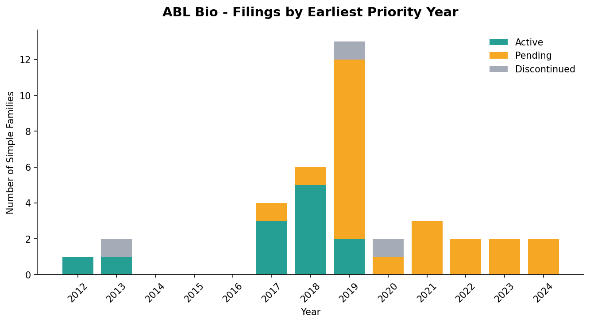
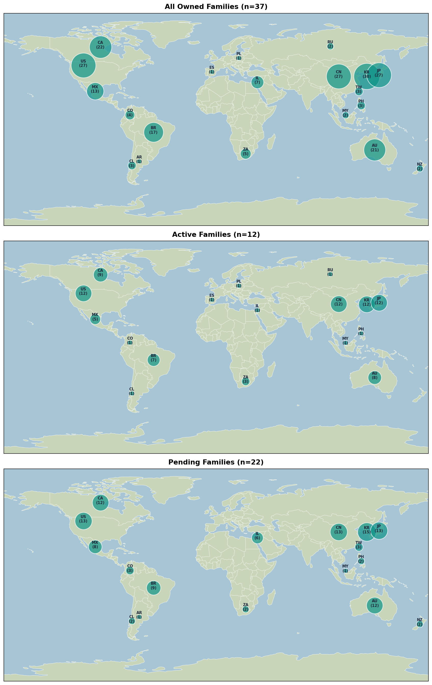
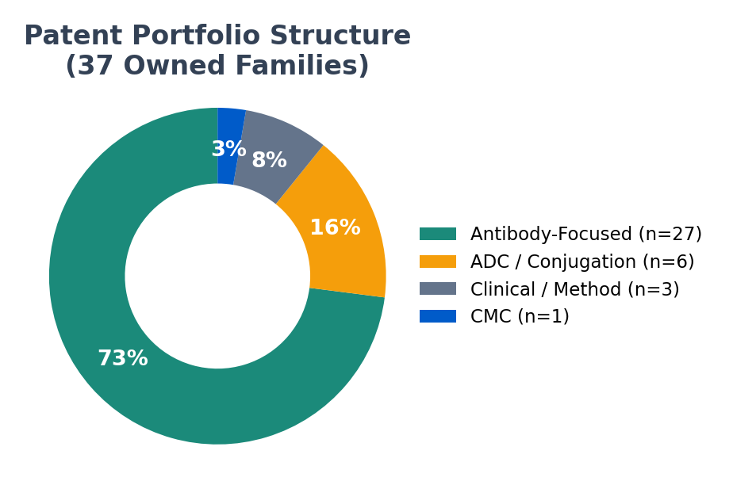
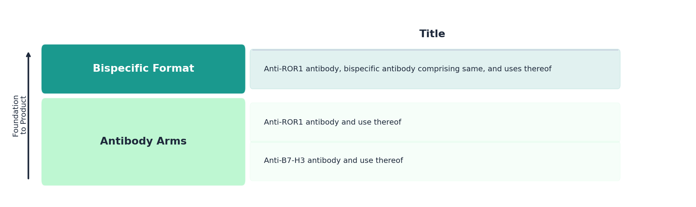
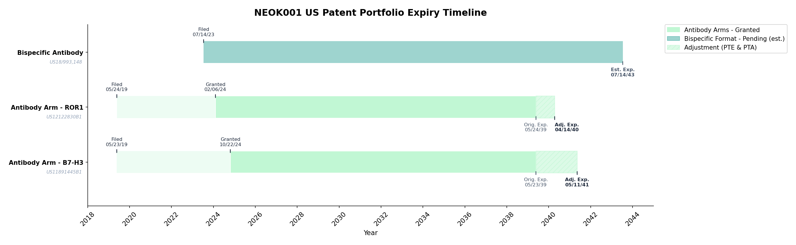

# NEOK001 Patent Portfolio Analysis
*Author: Yuying Fan | April 2026*  
*NEOK001 background: [`reports/2_ABL_Bio_NEOK_Bio_Background.md`](2_ABL_Bio_NEOK_Bio_Background.md)*  
*Full methodology and code: [`notebooks/5c_neok001_portfolio.ipynb`](../notebooks/5c_neok001_portfolio.ipynb)*   
ABL Bio Portfolio Composition | NEOK001 Patent Families | Coverage

## 1. Objective
Analyze ABL Bio's patent portfolio to examine patent composition as well as identify which families cover NEOK001, the ROR1×B7-H3 bispecific ADC. Further assess their geographic coverage, claim strength, and timeline (flag any strategic gaps relevant to Phase 1 clinical advancement).

 

## 2. Methodology

**Data source:** Lens.org patent database, queried with applicant/owner terms `"ABL BIO INC KR"`, `"ABL BIO INC"`, `"ABL BIO"`, `"ABL BIO INCORPORATED"`.

**Key finding on Lens conventions:** querying by applicant returned 466 patent records (37 simple families after family-level expansion); querying by owner returned 437 records (24 simple families)
- Difference is because Lens populates the Owner field from the applicant when ownership is NaN
- No families exist where ABL Bio is owner but not applicant; no acquisition-based portfolio growth 

**Conclusion on ABL Bio portfolio size:** ABL Bio has **37 simple families ("inventions")** originating from their own filings.

**Legal status verification:** The Lens legal status field reflects the representative patent only, so each family member jurisdiction's status was manually verified via Google Patents and jurisdiction-specific patent offices (USPTO, EPO, KIPO, CNIPA, JPO, TIPO).

**Family classification:** Families were manually annotated by composition type (pure antibody, bispecific antibody, ADC conjugate, clinical method, CMC) based on CPC codes and claim-scope review.

 

## 2. ABL Bio Patent Portfolio

Full picture of ABL Bio's 37 patent families before narrowing to NEOK001-specific filings.

### Filing Velocity

ABL Bio's 37 simple families span priority years of 2012 to 2024 with distinct phases:
- **Sparse early filings (2012–2013):** 3 families, mostly discontinued, reflecting ABL Bio's early stage before platform technology matured
- **Foundational period (2017–2019):** 23 of 37 families filed; likely captures the core antibody platform filings and the bispecific foundational patents
- **Expansion phase (2020–2024):**

_Filings from 2020–2024 are predominantly pending, consistent with standard USPTO/international prosecution timelines of 3–5 years from filing to grant_

### Jurisdiction Coverage
ABL Bio files broadly, with coverage concentrated in:
- **KR** (home jurisdiction) - 30 families
- **US, WO, EP, JP, CN** — priority markets
- **AU, CA, BR, IL, MX, TW** - selective filings

### Composition of Patent Portfolio

From manual annotation of all 37 simple patent families by composition type based on CPC codes and claims:

**1A) Purely Antibody Composition Patents** (n=11)
- Families 1, 2, 6, 8, 10, 11, 12, 15, 22, 27, 31
- Dominant CPC of C07K16/* (Immunoglobulins, e.g., monoclonal or polyclonal antibodies)
- Targets: DLL4, 4-1BB, BCMA, alpha-synuclein, B7-H3, ROR1, CLL-1

**1B) Bi-specific Antibody Composition Patents** (n=16)
- Families 3, 5, 7, 13, 14, 17, 18, 19, 20, 23, 24, 25, 26, 29, 30, 35
- Pairings: DLL4/VEGF, α-SYN/IGF1R, PD-L1/LAG3, B7-H4/4-1BB, BCMA/4-1BB, TIGIT/4-1BB, LILRB4/4-1BB, HER2/4-1BB, EGFR/4-1BB, ROR1/4-1BB, **ROR1/B7-H3** (NEOK001), PD-L1/B7-H3, Claudin 18.2/4-1BB

**2) ADC Composition Patents (Conjugate)** (n=6)
- Families 9 (Discontinued), 16, 28 (Discontinued), 32 (Discontinued), 33, 34
- **Family 9** — Payload-centric: Cyclopropabenzindole (CBI) cytotoxic payload linked to galactose trigger moiety (breadth in antibody, target)
- **Family 16** — Full ADC: antibody-drug conjugates targeting ROR1 including active metabolites and pharmaceutical compositions for ROR1-overexpressing cancers
- **Family 28** — Conjugated linker: conjugating any drug to the N-terminal α-amine of any antibody via linker with a reactive aldehyde (breadth in antibody, payload, target)
- **Family 32** — Full ADC: sequence-defined anti-ROR1 antibody conjugated via cleavable glucuronide/peptide linker architectures including site-specific conjugation and branched dual-payload designs
- **Family 33** — Full ADC: ROR1/B7-H3 bispecific antibody conjugated via cleavable glucuronide and peptide-based linker architectures including site-specific C-terminal engineering and branched multi-payload designs
- **Family 34** — Full ADC: similar to Family 33 but with a monospecific platform using anti-B7-H3 antibody

**3) Clinical Filings** (n=3)
- **Family 21** ("A method of treating a solid tumor") — CLDN18.2 bispecific antibody with specified dosing, schedules, routes, patient populations
- **Family 36** ("Combination of anti-claudin 18.2/anti-4-1bb antibodies and second therapeutic agent in treatment of cancer") — CLDN18.2/4-1BB bispecific + chemotherapy/ICIs in gastric cancer
- **Family 37** ("Methods of treating cancer by administering anti-pd-l1/anti-4-1bb bispecific antibodies") — PD-L1/4-1BB bispecific in advanced or metastatic solid tumors

**4) CMC Patents** (n=1)
- **Family 4** ("Method for Purifying Biologically Active Peptide by Using Protein A Affinity Chromatography") — improved purification process for Fc-containing biologics using differential Protein A binding based on VH3 domain number

_Note: Family number is just based on row location and order when exporting csv from Lens. The csv can be found in `raw/abl-37.csv`_

### Key Inventors

ABL Bio has approximately 4–5 core inventors appearing in ~40–50% of families:
- JUNG JINWON
- LEE YANGSOON
- SUNG BYUNGJE
- KIM JU EON
- PARK YOUNGWOOK

 

## 3. NEOK001-Specific Patent Families

### NEOK001-Relevant Families
| Family | Title | Lens ID | Layer |
|--------|-------|---------|-------|
| 8 | Anti-B7-H3 antibody and use thereof | 040-924-461-597-34X | Antibody Arms | 
| 10 | Anti-ROR1 antibody and use thereof | 132-024-389-417-675 | Antibody Arms | 
| 24 | Anti-ROR1 antibody, bispecific antibody comprising same, and uses thereof | 085-693-226-467-972 | Bispecific Format |
| 16 | Antibody-drug conjugate comprising antibody against human ROR1 | 130-301-980-653-720 | ROR1 ADC | 
| 34 | Antibody-drug conjugate comprising anti-B7-H3 antibody and its use | 051-245-872-017-682 | B7-H3 ADC | 
| 29 | Antibody that binds to ROR1 and B7-H3, antibody-drug conjugate containing same | 063-625-262-975-971 | Core Bispecific ADC (sequence-specific) |
| 33 | ROR1 and B7-H3 binding antibody-drug conjugate and use thereof | 141-269-859-464-516 | Core Bispecific ADC (broadest genus) |

_Note: Family numbers are based on row position in the Lens.org CSV export, not prosecution order._

### Claim-Level Analysis of the 7 Patents

Each family has been analyzed at the claim level; Full analysis appears in the accompanying notebook but key findings by patent, ordered by earliest priority date:

#### Family 8 — Anti-B7-H3 antibody and use thereof
**Lens ID:** 040-924-461-597-34X
**Layer:** Antibody Arms
**Co-assignee:** ABL Bio only

| Application | Jurisdiction | Filing Date | Status |
|-------------|-------------|-------------|--------|
| PCT/KR2018/005854 | WO | 2018-05-23 | Ceased (expected — superseded by 2019 PCT) |
| PCT/KR2019/006213 | WO | 2019-05-23 | Ceased (expected — national phase entered) |
| KR1020207037054A | KR | 2019-05-23 | **Active** |
| EP19806701.9A | EP | 2019-05-23 | Pending |
| CN201980034456.0A | CN | 2019-05-23 | **Active** |
| US17/057,646 | US | 2019-05-23 | **Active** (= US11891445B1) |
| JP2020564899A | JP | 2019-05-23 | **Active** |

**Overall Jurisdiction Coverage:** Strong 
— US/JP/CN/KR granted
- EP pending

**US11891445B1 (B7-H3 antibody arm, ACTIVE):**  
14 claims. Pure antibody patent with 7 matched CDR sets in Claim 1 (SEQ ID NO: 1–29). Full chain sequences, nucleic acid, vector, and cell-line protection. Claims 12–14 cover method-of-treating B7-H3 overexpressing cancer with immunoregulatory mechanism. **Foundation layer - composition-of-matter protection.**

**Protects:** NEOK001 (B7-H3 antibody arm)

---

#### Family 10 — Anti-ROR1 antibody and use thereof
**Lens ID:** 132-024-389-417-675
**Layer:** Antibody Arms
**Co-assignee:** ABL Bio only

| Application | Jurisdiction | Filing Date | Status |
|-------------|-------------|-------------|--------|
| PCT/KR2018/005968 | WO | 2018-05-25 | Ceased (expected) |
| PCT/KR2019/006270 | WO | 2019-05-24 | Ceased (expected) |
| KR1020207037055A | KR | 2019-05-24 | **Active** |
| EP19807093.0A | EP | 2019-05-24 | Pending |
| CN201980034890.9A | CN | 2019-05-24 | **Active** |
| CN202410586952.XA | CN | 2019-05-24 | Pending |
| US17/057,643 | US | 2019-05-24 | **Active** (= US12122830B1) |
| JP2020564922A | JP | 2019-05-24 | **Active** |

**Overall Jurisdiction Coverage:** Strong
— US/JP/CN/KR granted
- EP pending
- CN continuation pending

**US12122830B1 (ROR1 antibody arm, ACTIVE):**  
16 claims. Structure mirrors US11891445B1 exactly; suggests parallel drafting strategy. 10 matched CDR sets in Claim 1 (SEQ ID NO: 1–97). Claim 13 covers method of detecting ROR1 in biological samples, Claim 14 covers diagnostic method with control comparison. **Foundation layer - composition-of-matter protection, plus diagnostic method claims supporting potential CDx work.**

**Protects:** NEOK001 (ROR1 antibody arm)

---

#### Family 16 — Antibody-drug conjugate comprising antibody against human ROR1
**Lens ID:** 130-301-980-653-720
**Layer:** ADC Format
**Co-assignee:** ABL Bio + LigaChem Biosciences (formerly LegoChem, rebranded April 2024)

| Application | Jurisdiction | Filing Date | Status |
|-------------|-------------|-------------|--------|
| KR1020190109807A | KR | 2019-09-04 | Ceased |
| US16/940,326 | US | 2020-07-27 | **Active** (= US11707533B2) |
| PCT/IB2020/000649 | WO | 2020-07-27 | Ceased (expected) |
| AU2020343888A | AU | 2020-07-27 | Pending |
| EP20861806.6A | EP | 2020-07-27 | Pending |
| CA3153069A | CA | 2020-07-27 | Pending |
| IL314603A | IL | 2020-07-27 | Unknown |
| BR112022003589A | BR | 2020-07-27 | Unknown |
| MX2022002592A | MX | 2020-07-27 | Unknown |
| CN202010852078.1A | CN | 2020-08-21 | Pending |
| CN202110805667.9A | CN | 2020-08-21 | **Active** |
| TW109128698A | TW | 2020-08-21 | Unknown |
| JP2020143359A | JP | 2020-08-27 | **Active** |
| IL290979A | IL | 2022-02-28 | Unknown |
| US18/209,299 | US | 2023-06-13 | Pending |
| JP2023135580A | JP | 2023-08-23 | **Active** |
| TW112133782A | TW | 2023-07-14 | Unknown |
| AU2024205092A | AU | 2024-07-25 | Pending |
| JP2025135500A | JP | 2025-08-15 | Pending |

**Overall Jurisdiction Coverage:** Strong 
— US/JP(×2)/CN granted
- EP/AU/CA/CN pending
- Multiple continuations active

**US11707533B2 (ROR1 ADC, ACTIVE):**  
38 claims. ROR1 monospecific ADC with 10 specific CDR combinations in Claim 1. Claim 6 explicitly lists "bispecific, multispecific" antibody formats; potentially extends to NEOK001 at the genus level. But specifes glucuronic acid-based cleavable linker and site-specific farnesylation conjugation, which are CS5001 asset related. **Primarily protects CS5001; NEOK001 covered only via broad genus Claim 1 language.** The US continuation (US18/209,299) is drafted as a product-by-process claim specifically targeting CS5001's exact molecule (DAR=2, specific PBD payload, CVIM farnesylation, specific CDR option f)

**Protects:** Primarily CS5001 (ROR1 monospecific ADC, with LigaChem ConjuAll linker + PBD payload)
- Broad independent claims theoretically extend to NEOK001, but dependent claims increasingly narrow towards CS5001 (which are likely going to be the most robust and defensible protection; so enforceability concentrated around CS5001)

---

#### Family 34 — Antibody-drug conjugate comprising anti-B7-H3 antibody
**Lens ID:** 051-245-872-017-682
**Layer:** ADC Format
**Co-assignee:** ABL Bio + LigaChem Biosciences

| Application | Jurisdiction | Filing Date | Status |
|-------------|-------------|-------------|--------|
| KR1020190151539A | KR | 2019-11-22 | **Withdrawn** |

**Overall Jurisdiction Coverage:** Dead 
— only KR filing, withdrawn

> Note: Google Patents shows withdrawn; Lens shows pending 
> — Google Patents status is more reliable so using Withdrawn

**KR20210063070A (B7-H3 monospecific ADC, DEAD):** 146 claims. Monospecific B7-H3 ADC with structure Ab-(X)y. CDR sequences specified in Claim 1 (SEQ ID NO: 1–29). Extensive linker and conjugation chemistry claims (glucuronic acid, farnesylation, PEG spacers, oxime ligation, branched dual payload). Claim 135 noted "specificity for additional antigens beyond B7-H3" which could have supported bispecific extensions. **Its loss removes a potential B7-H3 ADC standalone protection.**

**Protects:** Was intended to protect B7-H3 monospecific ADC format

---

#### Family 29 — Antibody that binds to ROR1 and B7-H3, antibody-drug conjugate
**Lens ID:** 063-625-262-975-971
**Layer:** Core Bispecific ADC (sequence-specific fallback)
**Co-assignee:** ABL Bio only

| Application | Jurisdiction | Filing Date | Status |
|-------------|-------------|-------------|--------|
| PCT/KR2020/016600 | WO | 2020-11-23 | **Ceased** - no national phase entries made |

**Overall Jurisdiction Coverage:*** Dead 
— single WO filing, ceased with no national phase entries

**WO2021101349A1 (sequence-specific NEOK001 fallback, DEAD):**  
8 claims. Narrower but harder-to-challenge patent protecting the exact antibody sequences specified directly in Claim 1 (same CDR sequences as TW202313122A: SEQ ID NO: 1–19 for ROR1 arm, 57–62 for B7-H3 arm). Claim 7 listed specific payloads (PBD, AB009, MMAE, DM1) but notably omitted Topo-I inhibitors, relying on Claim 6's drug breadth. **Its loss removes the more-specific defensible fallback for the next patent family.**

**Protects:** NEOK001 (was intended to)

---

#### Family 33 — ROR1 and B7-H3 binding antibody-drug conjugate
**Lens ID:** 141-269-859-464-516
**Layer:** Core Bispecific ADC (broadest genus-level claim)
**Co-assignee:** ABL Bio + LigaChem Biosciences

| Application | Jurisdiction | Filing Date | Status |
|-------------|-------------|-------------|--------|
| KR1020210065657A | KR | 2021-05-21 | **Withdrawn** |
| PCT/KR2022/007260 | WO | 2022-05-20 | **Ceased** — no national phase entries made |
| TW111119008A | TW | 2022-05-20 | Unknown (TIPO status not verifiable; likely dead like other jurisdictions) |

**Overall Jurisdiction Coverage:** ❌ Dead/Unknown 
— KR withdrawn, WO ceased
- TW status unconfirmed, but likely similar

**TW202313122A (broadest NEOK001 genus, DEAD):**  
81 claims. Claim 1 gave broad composition-of-matter protection over the entire class of ROR1×B7-H3 bispecific ADCs with breadth in linker and payload chemistry. Dependent claims built layered fallback protection down to specific CDR sequences. Linker and conjugation chemistry mirrors US11707533B2 (glucuronic acid-based cleavable linker and site-specific farnesylation conjugation), which are CS5001 asset related. Claims 74–78 explicitly mentioned Topo-I inhibitors though (NEOK001's payload class). **Its loss removes the broadest genus protection for NEOK001.**

**Protects:** NEOK001 (was intended to)

---

#### Family 24 — Anti-ROR1 antibody, bispecific antibody comprising same
**Lens ID:** 085-693-226-467-972
**Layer:** Bispecific Format
**Co-assignee:** ABL Bio only

| Application | Jurisdiction | Filing Date | Status |
|-------------|-------------|-------------|--------|
| PCT/KR2023/010149 | WO | 2023-07-14 | Ceased (expected — national phase entered) |
| AU2023306100A | AU | 2023-07-14 | Pending |
| KR1020257001520A | KR | 2023-07-14 | Pending |
| US18/993,148 | US | 2023-07-14 | Pending |
| EP23840021.2A | EP | 2023-07-14 | Pending |
| JP2025501753A | JP | 2023-07-14 | Pending |
| CN202380053949.5A | CN | 2023-07-14 | Pending |
| CA3262028A | CA | 2023-07-14 | Pending |

**Overall Jurisdiction Coverage:** Pending
— None granted (filing too recent)
- Pending in US/EP/JP/CN/AU/CA/KR

**AU2023306100A (bispecific format, PENDING):**   
29 claims. Covers three distinct assets: ROR1 monospecific antibody, ROR1×4-1BB bispecific antibody (a different ABL Bio asset), and ROR1×B7-H3 bispecific antibody (relevant to NEOK001). **This is a bispecific antibody format patent; ADC protection appears only at Claim 25** (ROR1×B7-H3 bispecific conjugated to a cytotoxic drug, generic). Claims 6–8 protect diagnostic uses, supporting future CDx strategy.

**Protects:** NEOK001 (ROR1×B7-H3 bispecific antibody construct)

### Key Observations:

#### Critical Gap - Core Bispecific ADC Coverage Is Dead

**Three families that were intended to extend protection towards the NEOK001's specific construct are dead:**

| Family | Purpose | Status | Why Dead |
|--------|---------|--------|----------|
| F29 | Core Bispecific ADC sequence-specific fallback | ❌ Dead | WO ceased, no national phase entries |
| F33 | Core Bispecific ADC broadest genus claim | ❌ Dead | KR withdrawn, WO ceased, TW unverified |
| F34 | B7-H3 ADC format (monospecific) | ❌ Dead | Only KR filing, withdrawn |

#### Mention of Diagnostic Use - Potential CDx 
- F10 and 24 has later dependent claims that protect diagnostic uses for ROR1, supporting potential future CDx strategy

### Current Protection for NEOK001 
_Based on public information, filings could be within the 18-month publication delay of patent applications and are thus unknown_

| Layer | Family | Coverage |
|-------|--------|----------|
| Antibody Arms | F8, F10 | ✅ Protected separately (B7-H3 and ROR1 antibodies) |
| Bispecific Antibody Format | F24 | 🟡 Pending; covers bispecific antibody but ADC scope limited to Claim 25 |
| ADC Construct or Bispecific ADC Construct | F29, F33, F34 | ❌ Dead; withdrawn/ceased |

_F16 (ADC format with ROR1), that's active, mainly protecting CS5001 asset_

**In Summary:**
- NEOK001's ROR1 and B7-H3 antibody arms are protected individually
- The bispecific antibody format is pending (F24) but is primarily an antibody claim with only one ADC-related claim (Claim 25)
- The **full bispecific ADC construct**, NEOK001's actual commercial asset, has no active patent protection in any jurisdiction
- An **attempt was made for ROR1×B7-H3 bispecific ADC protection, but ceased/withdrawn** (F29, F33); With a layered IP approach where F33 was the broad genus covering any ROR1×B7-H3 bispecific ADC and F29 was the narrower sequence-specific (in Claim 1) defensive fallback
- Mentions of **ROR1 antibody for diagnostic use** in two patents (one active, one pending); potential CDx development

 

## 4. LigaChem (formerly LegoChem) Co-Assignment & CS5001-Specific Strategy

Of the 7 NEOK001-related patent families, 3 are co-assigned with LigaChem Biosciences:
- **Family 16** (ROR1 ADC) - core ABL Bio + LigaChem active patent underlying the CS5001 asset
- **Family 33** (Core Bispecific ADC genus) - co-assigned but dead across all jurisdictions
- **Family 34** (B7-H3 ADC) - co-assigned but dead

LigaChem is a co-assignee on the strong ROR1 ADC composition patent (F16, active), which protects the CS5001 asset
- F16's continuation is being narrowed toward CS5001 protection specifically, not toward NEOK001's bispecific configuration

> Notably, CS5001 (developed through collaboration between ABL Bio and LigaChem) was licensed externally by LigaChem to CStone Pharmaceuticals for ex-Korea development and commercialization. 
> The fact that CS5001 was licensed through LigaChem, despite co-development, suggests that commercially actionable rights may be concentrated around LigaChem-controlled elements of the asset, particularly those relating to linker–payload design and conjugation chemistry (which is what this continuation is narrowing down into)

### B7-H3 co-filings (F33, F34) and the platform shift

In addition to the ROR1-focused CS5001 program, ABL Bio and LigaChem co-filed on B7-H3 ADC constructs (F33, F34). This indicates that the collaboration was extending beyond ROR1 and seemingly moving into that bispecific ROR1×B7-H3 space.  

However, both B7-H3 patent families are now withdrawn or ceased. The precise cause cannot be determined from public data, though plausible explanations include the difficulty of securing broad ADC claims in a more mature B7-H3 prior art landscape, limited progression of pre-clinical programs, or strategic reprioritization. When NEOK001 filings began, it likely overlapped the time period of CS5001 and LigaChem's licensing discussions with CStone. So budget could also have shifted the focus on protecting the revenue-generating asset rather than an early-stage bispecific.

That platform shift is also another signal. NEOK001 uses Synaffix's SYNtecan-E linker-payload platform, distinct from the LigaChem ConjuAll chemistry that defines CS5001. This shift could be offering improved intellectual property positioning or enhanced therapeutic characteristics. The choice also moves NEOK001 outside the LigaChem-controlled platform IP and onto a separately licensed platform.

Taken together, the available evidence suggests that while initial efforts explored this bispecific route using LigaChem’s platform, development for NEOK001 was moved to the SYNtecan-E platform.

 

## 5. US Expiry Horizon Summary

| Application | Patent | Family | US Status | Grant Date | Adjusted Expiry |
|-------------|--------|--------|-----------|------------|-----------------|
| US17/057,643 | US12122830B1 | F10 - Anti-ROR1 antibody | ✅ Active | 2024-02-06 | **2040-04-14** |
| US17/057,646 | US11891445B1 | F8 - Anti-B7-H3 antibody | ✅ Active | 2024-10-22 | **2041-05-11** |
| US18/993,148 | US20260015418A1 | F24 - Bispecific format | 🟡 Pending | — | ~2043 (est.) |

- **PTE/PTA already applied to antibody arm patents** - both US11891445B1 (expires 2041) and US12122830B1 (expires 2040) have adjusted expiry dates beyond the standard 20-year term. _Patent term adjustment compensates for USPTO examination delays._
- **Granted patents cluster around 2040-2041 expiry** - The antibody arms expire within about a year of each other
- **Bispecific format pending with ~2043 expiry** - if granted, would extends NEOK001's US protection runway by 2-3 years beyond the antibody arm patents

### Strategic Recommendation

**<u>File new independent applications before Phase 1 disclosure</u>** 

Entirely new patent applications on NEOK001-specific results/progress that will become public with Phase 1 data:
- NEOK001's specific clinical profile (dosing, patient selection, biomarker criteria)
- Manufacturing process claims
- Formulation claims
- Companion diagnostic methods (leveraging F8/F10 claims diagnostic language)

Time-sensitive option as once Phase 1 data is disclosed at a conference or in a press release, those innovations become prior art and cannot be patented.

**<u>Prevents sole reliance on the pending Patent Family 24</u>** 

Reliance on pending patent family to provide composite coverage is riskier because:
- F24 is pending, not granted (with claim scope likely narrowing during prosecution)
- F24's ADC mention and coverage is also limited to Claim 25
- The claims span ROR1 monospecific antibody, ROR1×4-1BB bispecific antibody (different ABL Bio asset), and ROR1×B7-H3 bispecific antibody (relevant to NEOK001); if claim scope narrows during prosecution amendments to the other asset, limits protection to NEOK001

 

## 6. Limitations

- Lens.org legal status is for representative-patent only. Each family member was manually verified, but some jurisdictions (IL, BR, MX, TW) returned "Unknown" status that could not be resolved through Google Patents.
- The claim analysis was done manually by myself. This report summarizes claims based on public patent records text and my own understanding from it

 

