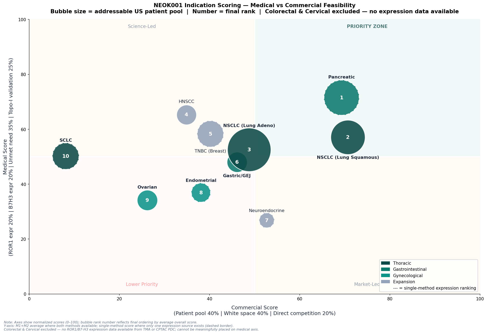

# 6. Final Strategic Recommendation for NEOK001 Development
*Author: Yuying Fan | April 2026*

## TL;DR
> **Initiate Phase 1 in pancreatic ductal adenocarcinoma (PDAC) as primary, with NSCLC (Lung Squamous) and gastric/GEJ as the secondary and tertiary indication, respectively.** PDAC ranked #1 using the second expression method, had the highest unmet need of the 12 indications evaluated, faces the cleanest competitive ADC landscape and addresses a ~$3.2B near-term US 2L+ market with a with a ~$320M–$480M base-case peak annual revenue (Year 4 post-launch). In terms of IP, the asset's bispecific ADC composition is not directly protected by a granted or pending composition patent. Family 24 (ROR1 bispecific format) is the most important pending filing in the portfolio and warrants prosecution focus and continuation strategy ahead of Phase 1 readout.

---

## Indication Recommendation

| Priority | Indication | Rationale |
|----------|-----------|-----------|
| **Primary** | Pancreatic (PDAC) | Highest unmet need (mOS 4.2 mo), least competitive ADC space, Topo-I in SOC |
| **Secondary** | NSCLC (Lung Squamous) | Highest ROR1 protein (+0.200 CPTAC), least competitive NSCLC (6 Ph2/3 trials), strongest fallback primary |
| **Tertiary** | Gastric/GEJ | Only 1 direct competitor, unique high-intensity B7H3 expression (H-score 201–300) |

*Full analysis: [`reports/3_Indication_Scoring.md`](3_Indication_Scoring.md) & [`reports/4_Market_Research.md`](4_Market_Research.md)*  

  

  

## IP Recommendation

**NEOK001's bispecific ROR1×B7-H3 ADC asset is not directly protected by any granted or pending composition patent** 
- Two families that would have provided core composition coverage (Family 29 and 33) are no longer active
- Direct NEOK001 IP currently consists of the granted antibody arm patents (Family 10, US11891445B1, for B7-H3 & Family 8, US12122830B1, for ROR1) as well as the pending bispecific format application for ROR1 (Family 24, US18/993,148).

_Strategic implication: Family 24 prosecution becomes the most important IP action for the program currently_

#### <u>Recommended priorities:</u>
- **Aggressive prosecution of Family 24** - broaden or adjust claims during examinatio, before grant, to expand protection of the bispecific format claim towards NEOK001
- **Continuation/CIP filings** on Family 24 - layer claims for manufacturing processes, formulations and dosing regimens at protocol lock (before public registration); File additional CIPs based on Phase 1 readout
- **Method-of-treatment claims tied to PDAC** - file at protocol lock on dosing schedule, biomarker selection criteria, and patient selection methodology; file again post-readout on combination regimens or subpopulation-specific use validated by Phase 1 data
- **Data exclusivity reliance** - 12-year biologics exclusivity will provide meaningful extension of runway given the current thin patent moat
- **Synaffix linker IP dependency** which is not solvable through filings, but warrants attention in this licensing relationship and any further downstream patent filings
  
*Full analysis: [`5_ip_portfolio`](../notebooks/5_ip_portfolio/) folder* 

> ## Limitations
> Limitations specific to each workstream are mentioned at the end of their corresponding report (Reports 3–5c). Please refer to those for analysis-specific caveats.  
>   